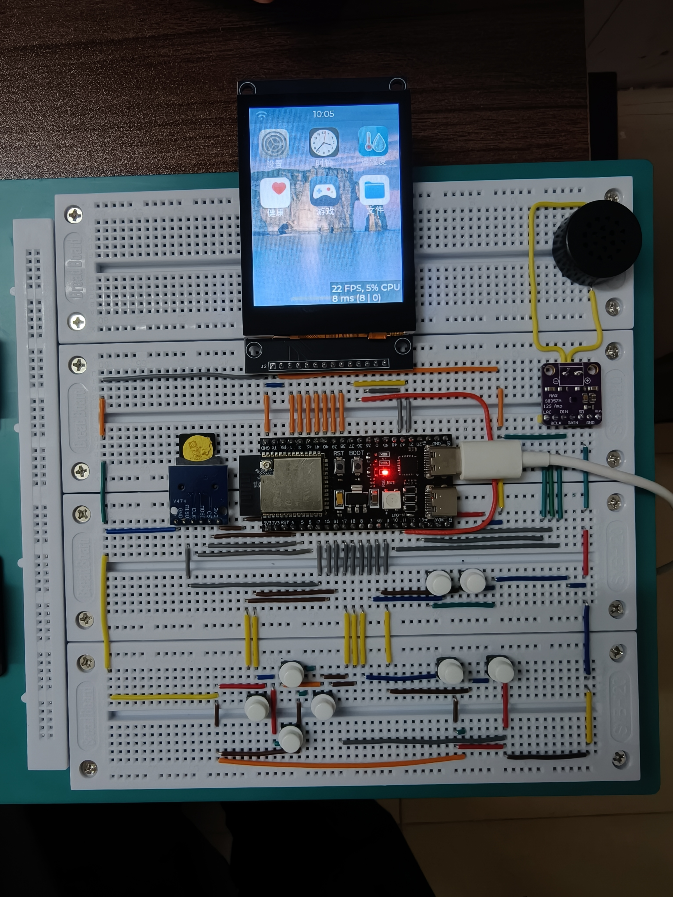

# ESP32-S3 仿手机 UI 项目

这是一个基于 **ESP-IDF** 框架和 ESP32-S3 的仿手机用户界面（UI）项目。该项目旨在为嵌入式设备提供一个直观、美观且功能丰富的交互界面，模仿现代智能手机的操作体验。

## 项目演示

您可以在 Bilibili 上观看项目的演示视频：
https://www.bilibili.com/video/BV1DmYN6HEnQ/

## 截图展示



## 主要功能

目前项目已实现以下功能：

*   **MP3 播放器**：支持音频文件的播放与控制。
*   **NES 游戏机模拟器**：可以运行经典的 NES (任天堂娱乐系统) 游戏。
*   **中文日历**：显示日期、时间，并支持中文界面。

## 未来计划

更多功能正在开发和更新中，敬请期待！

## 硬件要求

*   ESP32-S3 开发板
*   TFT LCD 显示屏 (具体型号请参考代码或原理图)
*   其他外设 (如扬声器、SD卡模块等，根据具体功能需求)

## 环境搭建

本项目使用 **ESP-IDF v6.0.2** 进行开发。请确保您已经安装了该版本的 ESP-IDF 环境。

1.  参考 [ESP-IDF 编程指南](https://docs.espressif.com/projects/esp-idf/zh_CN/latest/esp32s3/get-started/index.html) 安装 ESP-IDF。
2.  切换或安装 **v6.0.2** 版本以确保兼容性。

## 如何编译和上传

### 方法一：使用命令行

1.  克隆本仓库到您的本地机器：
    ```bash
    git clone <repository-url>
    cd xiaocai_esp32_project
    ```

2.  设置 ESP-IDF 环境：
    ```bash
    . $IDF_PATH/export.sh  # Linux/macOS
    %IDF_PATH%\export.bat  # Windows
    ```

3.  配置项目（可选）：
    ```bash
    idf.py menuconfig
    ```

4.  编译项目：
    ```bash
    idf.py build
    ```

5.  连接您的 ESP32-S3 开发板，然后上传代码并监控串口输出：
    ```bash
    idf.py -p PORT flash monitor
    ```
    请将 `PORT` 替换为您的开发板对应的串口端口（例如 `/dev/ttyUSB0` 或 `COM3`）。

### 方法二：使用 VS Code ESP-IDF 插件

1.  在 VS Code 中安装 "Espressif IDF" 插件。
2.  打开项目文件夹。
3.  配置 ESP-IDF 环境（选择 v6.0.2）。
4.  使用插件提供的功能进行编译、烧录和监控。

## 贡献

欢迎任何形式的贡献，包括问题报告、功能请求和代码提交。

## 许可证

本项目采用 **非商业性使用** 许可协议。仅供个人学习、研究和交流使用，严禁用于任何商业用途。详情请参阅 [LICENSE](LICENSE) 文件。
