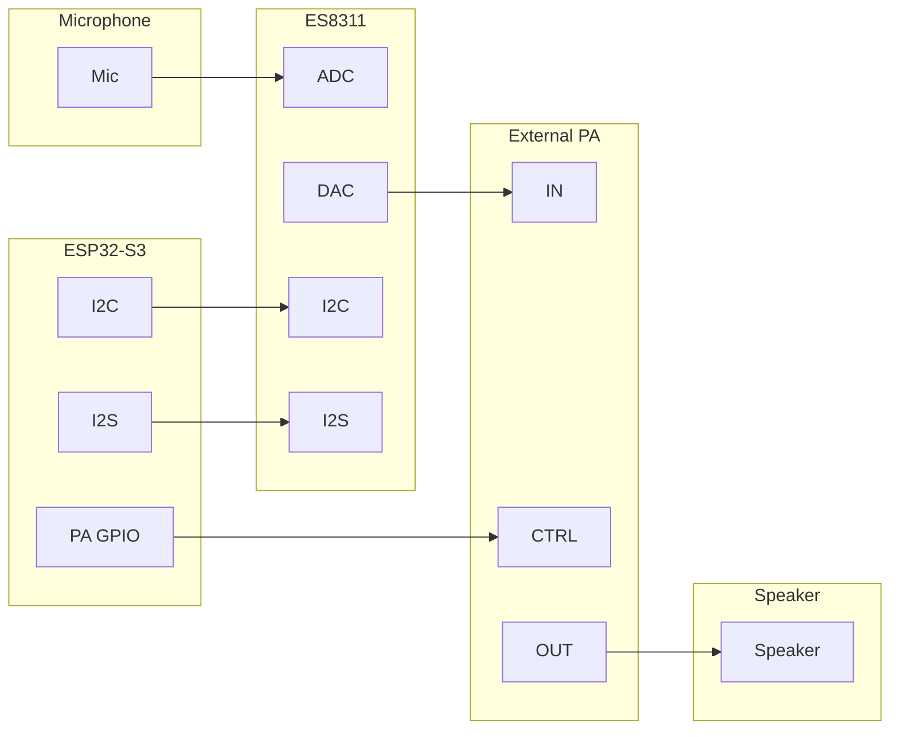
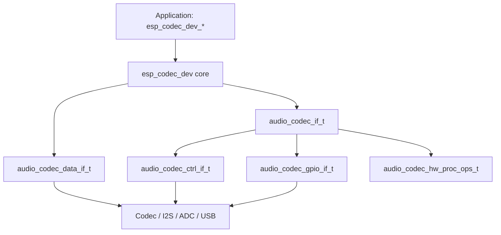

# ESP Codec Device

- [](https://components.espressif.com/components/espressif/esp_codec_dev)
- [中文版本](./README_CN.md)

## Overview

`esp_codec_dev` is the ADF driver component for external and on-chip audio codec devices. Applications use `esp_codec_dev_*` for playback, recording, volume, mute, gain, register access, data layout, hardware audio processing, and capability query. The component binds one chip driver (`audio_codec_if_t`) with one data path (`audio_codec_data_if_t`) and one control path (`audio_codec_ctrl_if_t`, usually I2C or SPI).

## Migrating from 1.x to v2.0

If your project still uses `esp_codec_dev` 1.x, read the full guide before upgrading to v2.0: [docs/api_migration_guide.md](docs/api_migration_guide.md).

Key changes at a glance:

- **Interface model**: `audio_codec_if_t` changed from a flat callback table to `hw_base + adc_if + dac_if` (optional `hw_proc`)
- **Configuration**: Each chip `codec_cfg` now uses shared sub-configs such as `sys_cfg` / `adc_cfg` / `dac_cfg` / `pa_cfg` / `reset_cfg`; chips select the subset that matches their hardware capability
- **Stream parameters**: Construction-time fields such as `mclk_div` and ES7210 `mic_selected` move into `esp_codec_dev_open()` `fs` (for example `mclk_multiple`, `channel_mask`)
- **Data layout**: New `esp_codec_dev_set/get_data_layout()` APIs (and label variants); do not assume bus order always equals memory order
- **I2C**: Must use `i2c_master` and pass `bus_handle` in `audio_codec_i2c_cfg_t` (`port` removed)
- **API renames**: `esp_codec_set_disable_when_closed` → `esp_codec_dev_set_disable_when_closed`; `esp_codec_dev_col_calc_hw_gain` → `esp_codec_dev_vol_calc_hw_gain`
- **Work mode**: `ESP_CODEC_DEV_WORK_MODE_*` and per-chip `codec_mode` removed; direction is set by `esp_codec_dev_cfg_t.dev_type` and runtime enable/open

Apps that only use the upper-layer `esp_codec_dev_*` APIs usually need small changes. If you instantiate chip drivers directly or provide a custom `ctrl_if` / `data_if`, follow the migration guide item by item.

## Features

- Drivers for common audio codec chips (see supported list below)
- Separate control and data paths: I2C/SPI for chip setup, I2S/on-chip ADC/USB UAC for PCM transfer
- Chip capabilities unified in `audio_codec_if_t`; configuration grouped as clock, ADC, DAC, PA, and reset
- Multiple codec device instances, including same-type devices and multiple devices on one I2S port
- Unified upper-layer API `esp_codec_dev_*` for playback and capture (volume, mute, gain, registers, capability query)
- Explicit PCM memory channel order; software reorder when hardware cannot match
- Chip hardware audio processing (ALC, DRC, EQ, line, mute, etc., chip-dependent)
- Custom codec support: implement or reuse control/data interfaces and instantiate a chip driver from the template
- On-chip ADC microphone capture via `audio_codec_new_adc_data`
- PA-only speaker designs via dummy codec (`dummy_codec_new`); PA power tied to `esp_codec_dev_open/close`
- Software volume when hardware volume is unavailable; custom volume curve and volume handler supported
- Port to other platforms by replacing implementations under [platform/](platform/)

Supported codec chips (playback / record / hardware audio processing). See [docs/features.md](docs/features.md) for the full capability matrix. **HW verified** means the driver has been exercised on real hardware in this component's test apps; other chips remain supported in code but are not yet hardware-verified for v2.0.

| Chip | Playback | Record | HW proc | HW verified |
| :--- | :------: | :----: | :-------- | :---------: |
| ES7210 | N | Y | ALC, mute | Y |
| ES7243 | N | Y | - | Y |
| ES7243E | N | Y | - | Y |
| ES8156 | Y | N | - | N |
| AW88298 | Y | N | - | N |
| TAS5805M | Y | N | - | N |
| ZL38063 | Y | N | - | N |
| ES8311 | Y | Y | ALC, DRC, EQ, mute | Y |
| ES8388 | Y | Y | ALC, line | Y |
| ES8389 | Y | Y | - | Y |
| ES8374 | Y | Y | - | N |
| CJC8910 | Y | Y | - | N |
| dummy | Y | N | - | N |

Verified data paths (not chip drivers): on-chip ADC (`audio_codec_new_adc_data`), USB UAC, and I2S PDM TX.

## Architecture overview

Hardware connection and software layering are shown below using ES8311 on ESP32-S3 as an example.



ESP32-S3 sends control commands over I2C and exchanges PCM over I2S. During playback, ES8311 performs DAC, the external PA amplifies the signal, and the speaker outputs audio. During recording, ES8311 performs ADC on the microphone signal and returns PCM to ESP32-S3.

Software layering:



`esp_codec_dev` binds one `audio_codec_if_t` and one `audio_codec_data_if_t`. The chip interface is created from chip configuration (for example `es8311_codec_new()` or `audio_codec_new("es8311", &cfg, sizeof(cfg))`). The data interface is created from the bus implementation (for example `audio_codec_new_i2s_data()`). Inside `audio_codec_if_t`, `hw_base` handles open/close, sample format, register access, order list, and caps; `adc` and `dac` expose direction-specific enable, volume, gain, and mute; optional `hw_proc` creates ALC/DRC/EQ/line/mute hardware audio processing handles.

## Directory structure

| Path | Description |
| --- | --- |
| `include/` | Main public API: `esp_codec_dev.h`, type definitions, volume API, and default configuration (`audio_codec_cfg_t`, `audio_codec_new()`) |
| `include/impl/` | Extended interfaces: UAC manager and ADC data interface |
| `include/hw_proc/` | Hardware audio processing API headers (ALC, DRC, EQ, line, mute) |
| `interface/` | Control, data, GPIO, codec base interfaces, and shared hardware sub-config `audio_codec_hw_cfg.h` |
| `device/` | Per-chip drivers and `device/include/` chip headers |
| `platform/` | ESP-IDF platform bindings (I2C, I2S, GPIO, ADC, USB UAC) |
| `src/` | Core implementation, data layout, software volume, and hw_proc dispatch |
| `docs/` | Upgrade guide, feature overview, data layout, I2S guides, FAQ |
| `test_apps/` | Unity test applications |

## DAC volume setting

Volume is set through `esp_codec_dev_set_out_vol`. Supported methods:

1. Codec hardware volume register
2. Built-in software volume when hardware volume is unavailable
3. Custom volume handler through `esp_codec_dev_set_vol_handler`

The user volume range is 0 to 100. With the default curve, volume 100 maps to 0 dB and volume 0 maps to -96 dB (mute). Between volume 1 and 100, the default mapping is linear from about -49.5 dB to 0 dB (roughly 0.5 dB per step). Use `esp_codec_dev_set_vol_curve()` with sorted `esp_codec_dev_vol_map_t` entries to customize the mapping.

When software volume is active, `esp_codec_dev_write()` may modify the input buffer in place. Ensure the write buffer is writable.

Audio gain has a software part (adjustable) and a hardware part (fixed by the analog front end). Configure `esp_codec_dev_hw_gain_t` in codec configuration to balance loudness across boards. See [esp_codec_dev_vol.h](include/esp_codec_dev_vol.h).

## Quick start

Requirements: I2C and I2S drivers initialized by the application. ESP-IDF version follows [idf_component.yml](idf_component.yml).

Enable the target chip in menuconfig (`Audio Codec Device Configuration`, for example `CONFIG_CODEC_ES8311_SUPPORT`). For a full board setup, see [boards/esp32s3/test_board.c](test_apps/codec_dev_test/main/boards/esp32s3/test_board.c). More board examples and Unity tests: [test_apps/codec_dev_test/](test_apps/codec_dev_test/). USB UAC tests: [test_apps/codec_dev_uac_test/](test_apps/codec_dev_uac_test/).

1. Initialize the control and data buses (I2C, I2S handles).

2. Create default control, data, and GPIO interfaces:

```c
audio_codec_i2s_cfg_t i2s_cfg = {
    .port = I2S_NUM_0,
    .rx_handle = rx_handle,
    .tx_handle = tx_handle,
};
const audio_codec_data_if_t *data_if = audio_codec_new_i2s_data(&i2s_cfg);

audio_codec_i2c_cfg_t i2c_cfg = {
    .addr = ES8311_CODEC_DEFAULT_ADDR,
    .bus_handle = i2c_bus_handle,
};
const audio_codec_ctrl_if_t *out_ctrl_if = audio_codec_new_i2c_ctrl(&i2c_cfg);
const audio_codec_gpio_if_t *gpio_if = audio_codec_new_gpio();
```

3. Create the codec interface with grouped configuration:

```c
es8311_codec_cfg_t es8311_cfg = {
    .ctrl_if = out_ctrl_if,
    .gpio_if = gpio_if,
    .sys_cfg = {
        .is_master = false,
        .no_mclk = false,
    },
    .pa_cfg = {
        .pa_pin = YOUR_PA_GPIO,
        .pa_active_low = false,
    },
};
const audio_codec_if_t *out_codec_if = es8311_codec_new(&es8311_cfg);
```

4. Create the device handle and run playback or recording:

```c
esp_codec_dev_cfg_t dev_cfg = {
    .codec_if = out_codec_if,
    .data_if = data_if,
    .dev_type = ESP_CODEC_DEV_TYPE_IN_OUT,
};
esp_codec_dev_handle_t codec_dev = esp_codec_dev_new(&dev_cfg);

esp_codec_dev_set_out_vol(codec_dev, 60);
esp_codec_dev_sample_info_t fs = {
    .sample_rate = 48000,
    .channel = 2,
    .bits_per_sample = 16,
};
esp_codec_dev_open(codec_dev, &fs);

uint8_t data[256];
esp_codec_dev_write(codec_dev, data, sizeof(data));

esp_codec_dev_set_in_gain(codec_dev, 30.0f);
esp_codec_dev_read(codec_dev, data, sizeof(data));
esp_codec_dev_close(codec_dev);
esp_codec_dev_delete(codec_dev);
```

5. Release bus and codec interfaces when they are no longer shared: `audio_codec_delete_codec_if()`, `audio_codec_delete_data_if()`, `audio_codec_delete_ctrl_if()`.

### ADC mic and dummy codec (no external codec chip)

For boards with an internal ADC microphone and a speaker PA but no external codec:

* Use `audio_codec_new_adc_data()` as the record data interface when `CONFIG_CODEC_DATA_ADC_SUPPORT` is enabled.
* Use `dummy_codec_new()` with `pa_cfg` to bind PA power control to the codec lifecycle.
* Call `esp_codec_dev_open()` / `esp_codec_dev_close()` to enable or disable the PA automatically.

```c
dummy_codec_cfg_t dummy_cfg = {
    .gpio_if = gpio_if,
    .pa_cfg = {
        .pa_pin = YOUR_PA_GPIO,
        .pa_active_low = false,
    },
};
const audio_codec_if_t *dummy_if = dummy_codec_new(&dummy_cfg);
```

### USB UAC devices

When `CONFIG_CODEC_UAC_SUPPORT` is enabled, install the USB Host stack first, then derive `esp_codec_dev` handles through the UAC manager. Release each derived handle with `esp_codec_dev_uac_del_dev()` before `esp_codec_dev_uac_uninstall()`.

```c
#include "usb/usb_host.h"
#include "esp_codec_dev_uac.h"

// 1. Install USB Host (application responsibility)
usb_host_install(&(usb_host_config_t){ .intr_flags = ESP_INTR_FLAG_LEVEL1 });

// 2. Install UAC manager and derive a full-duplex device
static void uac_event_cb(const esp_codec_dev_uac_event_info_t *info, void *ctx)
{
    (void)ctx;
    if (info->event == ESP_CODEC_DEV_UAC_EVENT_CONNECTED) {
        // info->addr, info->dev_type
    }
}
esp_codec_dev_uac_install(&(esp_codec_dev_uac_cfg_t){
    .connect_timeout_ms = 15000,
    .event_cb = uac_event_cb,
});
esp_codec_dev_uac_select_t sel = {
    .mode = ESP_CODEC_DEV_UAC_SELECT_FIRST,
    .dev_type = ESP_CODEC_DEV_TYPE_IN_OUT,
};
esp_codec_dev_handle_t uac_dev = esp_codec_dev_uac_new_dev(&sel);

// 3. Playback and capture through the standard API
esp_codec_dev_set_out_vol(uac_dev, 60);
esp_codec_dev_sample_info_t fs = {
    .sample_rate = 48000,
    .channel = 2,
    .bits_per_sample = 16,
};
esp_codec_dev_open(uac_dev, &fs);

uint8_t data[256];
esp_codec_dev_write(uac_dev, data, sizeof(data));

esp_codec_dev_set_in_gain(uac_dev, 30.0f);
esp_codec_dev_read(uac_dev, data, sizeof(data));
esp_codec_dev_close(uac_dev);

// 4. Release derived handle, then uninstall manager
esp_codec_dev_uac_del_dev(uac_dev);
esp_codec_dev_uac_uninstall();
```

For playback-only or capture-only, set `dev_type` to `ESP_CODEC_DEV_TYPE_OUT` or `ESP_CODEC_DEV_TYPE_IN`. Register `event_cb` in `esp_codec_dev_uac_install()` for connect/disconnect notifications, or use `esp_codec_dev_uac_get_num()` and `esp_codec_dev_uac_get_info()` to poll connected devices, then bind by USB address with `ESP_CODEC_DEV_UAC_SELECT_BY_ADDR` and `sel.addr`. See [docs/features.md](docs/features.md) section 8 and [test_apps/codec_dev_uac_test/](test_apps/codec_dev_uac_test/) for more.

## Customize a new codec device

1. Implement `audio_codec_ctrl_if_t` and `audio_codec_data_if_t`, or reuse `audio_codec_new_i2c_ctrl()` and `audio_codec_new_i2s_data()`.

2. Implement `audio_codec_if_t` from a chip configuration structure:

```c
typedef struct {
    const audio_codec_ctrl_if_t *ctrl_if;
    const audio_codec_gpio_if_t *gpio_if;
    audio_hw_sys_cfg_t           sys_cfg;
    audio_hw_adc_cfg_t           adc_cfg;
    audio_hw_dac_cfg_t           dac_cfg;
    audio_hw_pa_cfg_t            pa_cfg;
    audio_hw_reset_cfg_t         reset_cfg;
} my_codec_cfg_t;

const audio_codec_if_t *my_codec_new(my_codec_cfg_t *codec_cfg);
```

See [common/my_codec.c](test_apps/codec_dev_test/main/common/my_codec.c) and [device/template_codec/](device/template_codec/).

## Notes

* Create I2C bus handles with `i2c_new_master_bus()` and pass `bus_handle` in `audio_codec_i2c_cfg_t`.
* I2S mode (STD, TDM, PDM) is taken from the underlying I2S channel; do not pass mode in `esp_codec_dev_sample_info_t`.
* Call `esp_codec_dev_open()` before read/write or data layout APIs. Match `dev_type` to the codec direction (IN, OUT, or IN_OUT).
* Set `adc_cfg.label` at initialization when using label-based data layout on multi-mic boards.
* Delete hardware audio processing handles before deleting the parent `audio_codec_if_t`.
* Chip drivers use grouped `codec_cfg` sub-configs; field usage varies by chip. See [docs/features.md](docs/features.md).
* Do not call the same `audio_codec_data_if_t` handle from multiple tasks concurrently.

## SoC compatibility

| Capability | Typical targets |
| --- | --- |
| I2S codec path | ESP32, ESP32-S2, ESP32-S3, ESP32-C3, ESP32-C6, ESP32-P4 |
| Internal ADC data interface | Targets with `SOC_ADC_SUPPORTED` and `CONFIG_CODEC_DATA_ADC_SUPPORT` |
| USB UAC | ESP32-S2, ESP32-S3, ESP32-S31, ESP32-P4, ESP32-H4 with `CONFIG_CODEC_UAC_SUPPORT` and USB Host wiring |
| ZL38063 firmware library | Xtensa only (do not enable `CONFIG_CODEC_ZL38063_SUPPORT` on RISC-V architecture chips) |

Per-chip Kconfig switches are under `Audio Codec Device Configuration` in menuconfig.

## FAQ

**Why does `esp_codec_dev_open()` return an error?**

Check that the target chip is enabled in menuconfig, `dev_type` matches the codec direction, I2C `bus_handle` is valid, and I2S TX/RX handles match the playback or record path. See [docs/FAQ.md](docs/FAQ.md) for log-specific causes.

**How do I set PCM channel order in memory?**

Call `esp_codec_dev_set_data_layout()` or `esp_codec_dev_set_data_layout_label()` after `esp_codec_dev_open()`. When hardware cannot match the requested order, read/write lengths must be aligned to one full frame. Details: [docs/data_layout/data_layout_logic.md](docs/data_layout/data_layout_logic.md).

**Can multiple codec devices share one I2S port?**

Yes. Create separate `audio_codec_data_if_t` instances (RX-only and TX-only handles can coexist on the same port). ES8311 and ES8389 additionally deduplicate control open/close for the same address on the same I2C bus.

More topics (I2S sharing, playback anomalies, upgrade): [docs/FAQ.md](docs/FAQ.md).

## Reference documentation

| Topic | Document |
| --- | --- |
| Feature overview | [docs/features.md](docs/features.md) |
| API and configuration upgrade | [docs/api_migration_guide.md](docs/api_migration_guide.md) |
| Codec chip online datasheets | [docs/codec_datasheets.md](docs/codec_datasheets.md) |
| Data layout logic | [docs/data_layout/data_layout_logic.md](docs/data_layout/data_layout_logic.md) |
| Memory channel order | [docs/data_layout/memory_data_layout.md](docs/data_layout/memory_data_layout.md) |
| ADC label mapping | [docs/data_layout/adc_label.md](docs/data_layout/adc_label.md) |
| ESP32 I2S basics | [docs/i2s_driver/esp32_i2s_driver.md](docs/i2s_driver/esp32_i2s_driver.md) |
| STD/TDM mix mode | [docs/i2s_driver/i2s_tdm_std_mixmode_guide.md](docs/i2s_driver/i2s_tdm_std_mixmode_guide.md) |
| I2S driver compatibility | [docs/i2s_driver/i2s_compatibility_guide.md](docs/i2s_driver/i2s_compatibility_guide.md) |
| FAQ | [docs/FAQ.md](docs/FAQ.md) |
