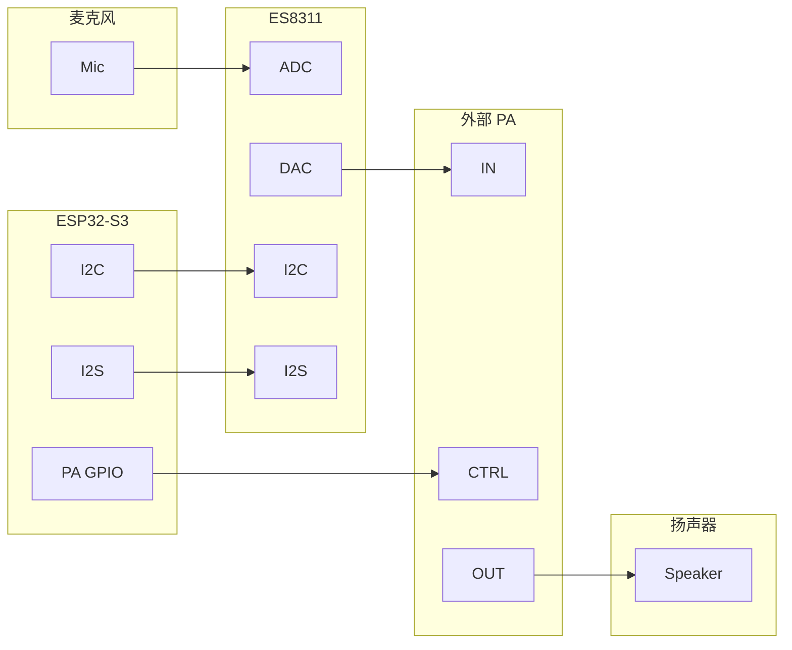
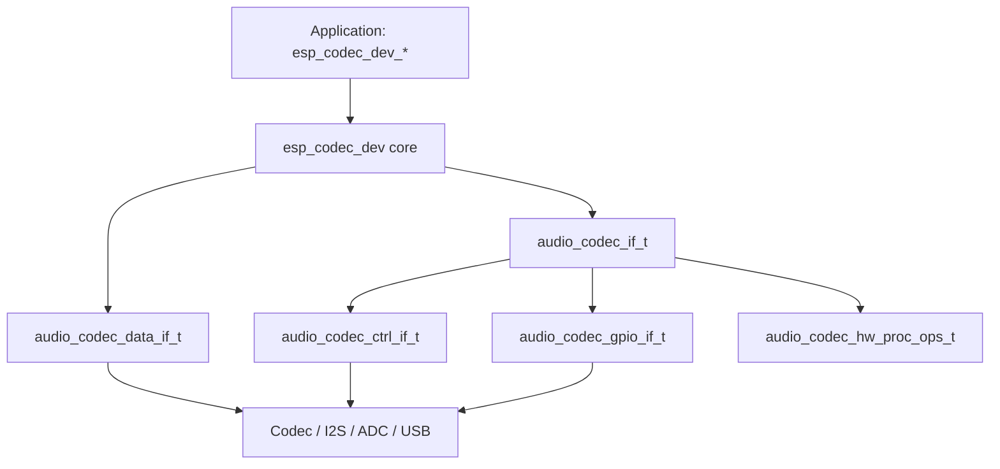

# ESP Codec Device

- [](https://components.espressif.com/components/espressif/esp_codec_dev)
- [English version](./README.md)

## 概要

`esp_codec_dev` 是 ADF 中面向外部及片上音频 codec 设备的驱动组件。应用通过 `esp_codec_dev_*` 完成播放、录音、音量、静音、增益、寄存器访问、数据布局、硬件音频处理与能力查询。组件将芯片驱动（`audio_codec_if_t`）、数据通路（`audio_codec_data_if_t`）与控制通路（`audio_codec_ctrl_if_t`，通常为 I2C 或 SPI）组合绑定。

## 从 1.x 迁移到 v2.0

若项目仍基于 `esp_codec_dev` 1.x，升级到 v2.0 前请先阅读完整说明：[docs/api_migration_guide.md](docs/api_migration_guide.md)。

主要变化速览：

- **接口模型**：`audio_codec_if_t` 由扁平回调表改为 `hw_base + adc_if + dac_if`（可选 `hw_proc`）
- **配置结构**：各芯片 `codec_cfg` 已迁到 `sys_cfg` / `adc_cfg` / `dac_cfg` / `pa_cfg` / `reset_cfg` 等公共子配置；按芯片能力选用对应子集
- **流参数时机**：原构造期的 `mclk_div`、`ES7210` 的 `mic_selected` 等，改为在 `esp_codec_dev_open()` 的 `fs`（如 `mclk_multiple`、`channel_mask`）中设置
- **数据布局**：新增 `esp_codec_dev_set/get_data_layout()`（及 label 版本）；勿再假设总线顺序恒等于内存顺序
- **I2C**：必须使用 `i2c_master`，在 `audio_codec_i2c_cfg_t` 中传入 `bus_handle`（已删除 `port`）
- **API 重命名**：`esp_codec_set_disable_when_closed` → `esp_codec_dev_set_disable_when_closed`；`esp_codec_dev_col_calc_hw_gain` → `esp_codec_dev_vol_calc_hw_gain`
- **工作模式**：`ESP_CODEC_DEV_WORK_MODE_*` / 各芯片 `codec_mode` 已删除，方向由 `esp_codec_dev_cfg_t.dev_type` 与运行时 enable/open 决定

仅使用 `esp_codec_dev_*` 上层 API 的应用改动通常较小；直接实例化芯片驱动或自定义 `ctrl_if` / `data_if` 时，请按迁移指南逐项适配。

## 功能特性

- 提供常用音频编解码器芯片驱动（见下方支持列表）
- 控制通路与数据通路分离：I2C/SPI 负责芯片配置，I2S、片上 ADC、USB UAC 负责 PCM 收发
- 芯片能力统一抽象为 `audio_codec_if_t`；配置按时钟、ADC、DAC、PA、复位分组
- 支持编解码器设备多实例，包括同类型设备及同一 I2S 端口上的多路设备
- 通过 `esp_codec_dev_*` 为播放与录音提供统一上层 API（音量、静音、增益、寄存器、能力查询）
- 支持显式声明 PCM 内存通道顺序；硬件无法满足时由软件重排
- 支持芯片硬件音频处理（ALC、DRC、EQ、line、mute 等，因芯片而异）
- 支持客户定制编解码器设备：实现或复用控制/数据接口，并按模板实例化芯片驱动
- 支持片上 ADC 麦克风采集（`audio_codec_new_adc_data`）
- PA-only 扬声器场景可使用 dummy codec（`dummy_codec_new`），经 `esp_codec_dev_open/close` 自动控制 PA
- 硬件不支持音量调节时使用软件音量，并支持自定义音量曲线与音量处理器
- 移植到其他平台时替换 [platform/](platform/) 实现即可

已支持的编解码器芯片（播放 / 录音 / 硬件音频处理）。更多能力见 [docs/features.md](docs/features.md)。**硬件实测**表示已在本组件测试应用中完成实机验证；其余芯片代码仍可用，但 v2.0 尚未完成硬件实测。

| 芯片 | 播放 | 录音 | 硬件音频处理 | 硬件实测 |
| :--- | :--: | :--: | :---------- | :------: |
| ES7210 | N | Y | ALC, mute | Y |
| ES7243 | N | Y | - | Y |
| ES7243E | N | Y | - | Y |
| ES8156 | Y | N | - | N |
| AW88298 | Y | N | - | N |
| TAS5805M | Y | N | - | N |
| ZL38063 | Y | N | - | N |
| ES8311 | Y | Y | ALC, DRC, EQ, mute | Y |
| ES8388 | Y | Y | ALC, line | Y |
| ES8389 | Y | Y | - | Y |
| ES8374 | Y | Y | - | N |
| CJC8910 | Y | Y | - | N |
| dummy | Y | N | - | N |

已实测的数据通路（非芯片驱动）：片上 ADC（`audio_codec_new_adc_data`）、USB UAC、I2S PDM TX。

## 架构预览

以下以 ESP32-S3 上的 ES8311 为例说明硬件连接与软件分层。



ESP32-S3 通过 I2C 发送控制命令，通过 I2S 交换 PCM。播放时 ES8311 完成 DAC，经外部 PA 放大后输出；录音时 ES8311 对麦克风信号做 ADC 并返回 PCM。

软件分层：



`esp_codec_dev` 绑定一个 `audio_codec_if_t` 与一个 `audio_codec_data_if_t`。芯片接口由芯片配置构造（例如 `es8311_codec_new()` 或 `audio_codec_new("es8311", &cfg, sizeof(cfg))`），数据接口由总线实现构造（例如 `audio_codec_new_i2s_data()`）。`audio_codec_if_t` 内部由 `hw_base` 负责 open/close、采样格式、寄存器、order 列表与 caps；`adc` 与 `dac` 提供方向相关的 enable、音量、增益与 mute；可选 `hw_proc` 用于创建 ALC/DRC/EQ/line/mute 硬件音频处理句柄。

## 目录结构

| 路径 | 说明 |
| --- | --- |
| `include/` | 主公开 API：`esp_codec_dev.h`、类型定义、音量接口与默认配置（含 `audio_codec_cfg_t`、`audio_codec_new()`） |
| `include/impl/` | 扩展接口：UAC 管理与 ADC 数据接口 |
| `include/hw_proc/` | 硬件音频处理头文件（ALC、DRC、EQ、line、mute） |
| `interface/` | 控制、数据、GPIO、codec 基类接口，以及共享硬件子配置 `audio_codec_hw_cfg.h` |
| `device/` | 各芯片驱动及 `device/include/` 配置头 |
| `platform/` | ESP-IDF 平台绑定（I2C、I2S、GPIO、ADC、USB UAC） |
| `src/` | 主要实现、数据布局、软件音量与 hw_proc 派发 |
| `docs/` | 升级指南、功能概览、数据布局、I2S 指南、FAQ |
| `test_apps/` | Unity 测试应用 |

## DAC 音量设定

音量通过 `esp_codec_dev_set_out_vol` 设置，支持以下方式：

1. codec 硬件音量寄存器
2. 内置软件音量，用于硬件不支持音量调节时
3. 通过 `esp_codec_dev_set_vol_handler` 设置自定义音量处理器

用户音量范围为 0 到 100。默认曲线下，100 对应 0 dB，0 对应 -96 dB（静音）。音量 1 到 100 之间默认近似线性映射，约从 -49.5 dB 到 0 dB（每档约 0.5 dB）。使用已排序的 `esp_codec_dev_vol_map_t` 数组调用 `esp_codec_dev_set_vol_curve()` 可自定义映射。

启用软件音量时，`esp_codec_dev_write()` 会原地修改输入 buffer，写入 buffer 须可写。

音频增益分为软件部分（可调）与硬件部分（由模拟前端固定）。在 codec 配置中设置 `esp_codec_dev_hw_gain_t` 可平衡不同板级的响度，详见 [esp_codec_dev_vol.h](include/esp_codec_dev_vol.h)。

## 快速开始

环境要求：应用侧需先初始化 I2C 与 I2S。ESP-IDF 版本以 [idf_component.yml](idf_component.yml) 为准。

在 menuconfig 的 `Audio Codec Device Configuration` 中启用目标芯片（例如 `CONFIG_CODEC_ES8311_SUPPORT`）。完整板级初始化见 [boards/esp32s3/test_board.c](test_apps/codec_dev_test/main/boards/esp32s3/test_board.c)。更多板级示例与 Unity 测试见 [test_apps/codec_dev_test/](test_apps/codec_dev_test/)；USB UAC 测试见 [test_apps/codec_dev_uac_test/](test_apps/codec_dev_uac_test/)。

1. 初始化控制与数据总线（I2C、I2S handle）。

2. 创建默认控制、数据、GPIO 接口：

```c
audio_codec_i2s_cfg_t i2s_cfg = {
    .port = I2S_NUM_0,
    .rx_handle = rx_handle,
    .tx_handle = tx_handle,
};
const audio_codec_data_if_t *data_if = audio_codec_new_i2s_data(&i2s_cfg);

audio_codec_i2c_cfg_t i2c_cfg = {
    .addr = ES8311_CODEC_DEFAULT_ADDR,
    .bus_handle = i2c_bus_handle,
};
const audio_codec_ctrl_if_t *out_ctrl_if = audio_codec_new_i2c_ctrl(&i2c_cfg);
const audio_codec_gpio_if_t *gpio_if = audio_codec_new_gpio();
```

3. 使用分组配置创建 codec 接口：

```c
es8311_codec_cfg_t es8311_cfg = {
    .ctrl_if = out_ctrl_if,
    .gpio_if = gpio_if,
    .sys_cfg = {
        .is_master = false,
        .no_mclk = false,
    },
    .pa_cfg = {
        .pa_pin = YOUR_PA_GPIO,
        .pa_active_low = false,
    },
};
const audio_codec_if_t *out_codec_if = es8311_codec_new(&es8311_cfg);
```

4. 创建设备句柄并进行播放或录音：

```c
esp_codec_dev_cfg_t dev_cfg = {
    .codec_if = out_codec_if,
    .data_if = data_if,
    .dev_type = ESP_CODEC_DEV_TYPE_IN_OUT,
};
esp_codec_dev_handle_t codec_dev = esp_codec_dev_new(&dev_cfg);

esp_codec_dev_set_out_vol(codec_dev, 60);
esp_codec_dev_sample_info_t fs = {
    .sample_rate = 48000,
    .channel = 2,
    .bits_per_sample = 16,
};
esp_codec_dev_open(codec_dev, &fs);

uint8_t data[256];
esp_codec_dev_write(codec_dev, data, sizeof(data));

esp_codec_dev_set_in_gain(codec_dev, 30.0f);
esp_codec_dev_read(codec_dev, data, sizeof(data));
esp_codec_dev_close(codec_dev);
esp_codec_dev_delete(codec_dev);
```

5. 接口不再共享时释放总线与 codec 接口：`audio_codec_delete_codec_if()`、`audio_codec_delete_data_if()`、`audio_codec_delete_ctrl_if()`。

### 使用 ADC mic 与 dummy codec（无外部 codec 芯片）

对于使用内部 ADC 麦克风、扬声器仅有 PA、无外部 codec 的板级设计：

* 启用 `CONFIG_CODEC_DATA_ADC_SUPPORT` 时，使用 `audio_codec_new_adc_data()` 作为录音数据接口。
* 使用 `dummy_codec_new()` 并配置 `pa_cfg`，将 PA 电源控制绑定到 codec 生命周期。
* 调用 `esp_codec_dev_open()` / `esp_codec_dev_close()` 可自动开关 PA。

```c
dummy_codec_cfg_t dummy_cfg = {
    .gpio_if = gpio_if,
    .pa_cfg = {
        .pa_pin = YOUR_PA_GPIO,
        .pa_active_low = false,
    },
};
const audio_codec_if_t *dummy_if = dummy_codec_new(&dummy_cfg);
```

### USB UAC 设备

启用 `CONFIG_CODEC_UAC_SUPPORT` 后，应用需先安装 USB Host 栈，再通过 UAC 管理器派生 `esp_codec_dev` 句柄。每个派生句柄用 `esp_codec_dev_uac_del_dev()` 释放，再调用 `esp_codec_dev_uac_uninstall()`。

```c
#include "usb/usb_host.h"
#include "esp_codec_dev_uac.h"

// 1. 安装 USB Host（应用负责）
usb_host_install(&(usb_host_config_t){ .intr_flags = ESP_INTR_FLAG_LEVEL1 });

// 2. 安装 UAC 管理器并派生全双工设备
static void uac_event_cb(const esp_codec_dev_uac_event_info_t *info, void *ctx)
{
    (void)ctx;
    if (info->event == ESP_CODEC_DEV_UAC_EVENT_CONNECTED) {
        // info->addr, info->dev_type
    }
}
esp_codec_dev_uac_install(&(esp_codec_dev_uac_cfg_t){
    .connect_timeout_ms = 15000,
    .event_cb = uac_event_cb,
});
esp_codec_dev_uac_select_t sel = {
    .mode = ESP_CODEC_DEV_UAC_SELECT_FIRST,
    .dev_type = ESP_CODEC_DEV_TYPE_IN_OUT,
};
esp_codec_dev_handle_t uac_dev = esp_codec_dev_uac_new_dev(&sel);

// 3. 按标准 API 播放与录音
esp_codec_dev_set_out_vol(uac_dev, 60);
esp_codec_dev_sample_info_t fs = {
    .sample_rate = 48000,
    .channel = 2,
    .bits_per_sample = 16,
};
esp_codec_dev_open(uac_dev, &fs);

uint8_t data[256];
esp_codec_dev_write(uac_dev, data, sizeof(data));

esp_codec_dev_set_in_gain(uac_dev, 30.0f);
esp_codec_dev_read(uac_dev, data, sizeof(data));
esp_codec_dev_close(uac_dev);

// 4. 释放派生句柄，再卸载管理器
esp_codec_dev_uac_del_dev(uac_dev);
esp_codec_dev_uac_uninstall();
```

仅播放或仅录音时将 `dev_type` 设为 `ESP_CODEC_DEV_TYPE_OUT` 或 `ESP_CODEC_DEV_TYPE_IN`。在 `esp_codec_dev_uac_install()` 中注册 `event_cb` 可接收连接/断开通知，也可用 `esp_codec_dev_uac_get_num()` 与 `esp_codec_dev_uac_get_info()` 轮询已连接设备，再使用 `ESP_CODEC_DEV_UAC_SELECT_BY_ADDR` 并设置 `sel.addr`。更多用法见 [docs/features.md](docs/features.md) 第 8 节与 [test_apps/codec_dev_uac_test/](test_apps/codec_dev_uac_test/)。

## 自定义编解码器设备

1. 实现 `audio_codec_ctrl_if_t` 与 `audio_codec_data_if_t`，或复用 `audio_codec_new_i2c_ctrl()` 与 `audio_codec_new_i2s_data()`。

2. 基于芯片配置结构实现 `audio_codec_if_t`：

```c
typedef struct {
    const audio_codec_ctrl_if_t *ctrl_if;
    const audio_codec_gpio_if_t *gpio_if;
    audio_hw_sys_cfg_t           sys_cfg;
    audio_hw_adc_cfg_t           adc_cfg;
    audio_hw_dac_cfg_t           dac_cfg;
    audio_hw_pa_cfg_t            pa_cfg;
    audio_hw_reset_cfg_t         reset_cfg;
} my_codec_cfg_t;

const audio_codec_if_t *my_codec_new(my_codec_cfg_t *codec_cfg);
```

参考 [common/my_codec.c](test_apps/codec_dev_test/main/common/my_codec.c) 与 [device/template_codec/](device/template_codec/)。

## 注意事项

* I2C 总线需用 `i2c_new_master_bus()` 创建，并在 `audio_codec_i2c_cfg_t` 中传入 `bus_handle`。
* I2S 模式（STD、TDM、PDM）由底层 I2S channel 决定，不要在 `esp_codec_dev_sample_info_t` 中传入 mode。
* 读写或设置数据布局前需调用 `esp_codec_dev_open()`，`dev_type` 需与 codec 方向（IN、OUT、IN_OUT）一致。
* 多麦板级使用 label 布局时，在初始化阶段设置 `adc_cfg.label`。
* 删除 `audio_codec_if_t` 前需先删除其下的硬件音频处理句柄。
* 各芯片驱动使用分组 `codec_cfg` 子配置，字段用法因芯片而异，见 [docs/features.md](docs/features.md)。
* 不要在多个任务中并发调用同一 `audio_codec_data_if_t` 句柄。

## SoC 兼容性

| 能力 | 典型目标芯片 |
| --- | --- |
| I2S codec 通路 | ESP32、ESP32-S2、ESP32-S3、ESP32-C3、ESP32-C6、ESP32-P4 |
| 片上 ADC 数据接口 | 具备 `SOC_ADC_SUPPORTED` 且启用 `CONFIG_CODEC_DATA_ADC_SUPPORT` 的目标 |
| USB UAC | ESP32-S2、ESP32-S3、ESP32-S31、ESP32-P4、ESP32-H4，需启用 `CONFIG_CODEC_UAC_SUPPORT` 并完成 USB Host 接线 |
| ZL38063 固件库 | 仅 Xtensa 架构（RISC-V 架构芯片勿启用 `CONFIG_CODEC_ZL38063_SUPPORT`） |

各芯片 Kconfig 开关位于 menuconfig 的 `Audio Codec Device Configuration`。

## FAQ

**`esp_codec_dev_open()` 返回错误怎么办？**

确认 menuconfig 已启用目标芯片、`dev_type` 与 codec 方向一致、I2C `bus_handle` 有效，且 I2S TX/RX handle 与播放或录音路径匹配。具体 log 原因见 [docs/FAQ.md](docs/FAQ.md)。

**如何设置内存中的 PCM 通道顺序？**

在 `esp_codec_dev_open()` 之后调用 `esp_codec_dev_set_data_layout()` 或 `esp_codec_dev_set_data_layout_label()`。硬件无法满足请求顺序时，读写长度须按整帧对齐。详见 [docs/data_layout/data_layout_logic.md](docs/data_layout/data_layout_logic.md)。

**多个 codec 设备能否共享同一 I2S 端口？**

可以。分别创建 `audio_codec_data_if_t` 实例（同一端口可同时存在 RX-only 与 TX-only handle）。ES8311 与 ES8389 还对同一 I2C bus 上相同地址的控制 open/close 做去重。

更多主题（I2S 共享、播放异常、升级）：[docs/FAQ.md](docs/FAQ.md)。

## 参考文档

| 主题 | 文档 |
| --- | --- |
| 功能概览 | [docs/features.md](docs/features.md) |
| API 与配置升级 | [docs/api_migration_guide.md](docs/api_migration_guide.md) |
| Codec 芯片在线文档 | [docs/codec_datasheets.md](docs/codec_datasheets.md) |
| 数据布局逻辑 | [docs/data_layout/data_layout_logic.md](docs/data_layout/data_layout_logic.md) |
| 内存通道顺序 | [docs/data_layout/memory_data_layout.md](docs/data_layout/memory_data_layout.md) |
| ADC label 映射 | [docs/data_layout/adc_label.md](docs/data_layout/adc_label.md) |
| ESP32 I2S 基础 | [docs/i2s_driver/esp32_i2s_driver.md](docs/i2s_driver/esp32_i2s_driver.md) |
| STD/TDM 混用 | [docs/i2s_driver/i2s_tdm_std_mixmode_guide.md](docs/i2s_driver/i2s_tdm_std_mixmode_guide.md) |
| I2S 驱动兼容 | [docs/i2s_driver/i2s_compatibility_guide.md](docs/i2s_driver/i2s_compatibility_guide.md) |
| FAQ | [docs/FAQ.md](docs/FAQ.md) |
