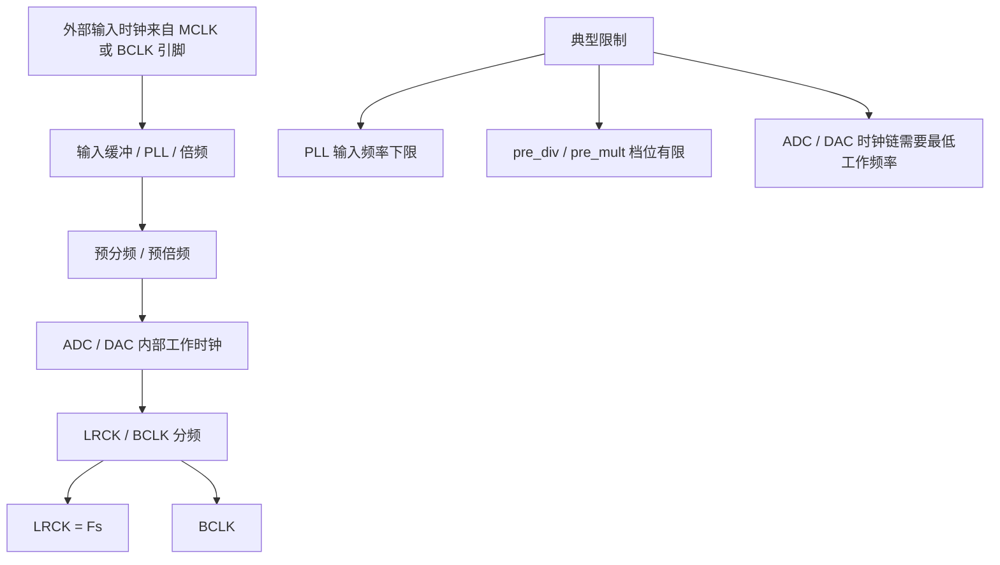
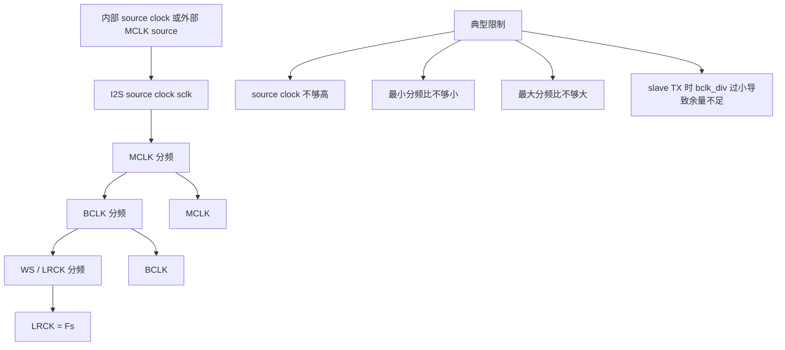

# esp_codec_dev 常见问题（FAQ）

本文汇总使用 `esp_codec_dev` 时的常见问题与处理思路。更细的数据布局、I2S 配置、API 迁移和功能说明请以对应专题文档为准。

---

## 相关文档

| 主题 | 文档 |
|------|------|
| 功能概览 | [features.md](./features.md) |
| API 与配置迁移 | [api_migration_guide.md](./api_migration_guide.md) |
| Codec 芯片在线文档 | [codec_datasheets.md](./codec_datasheets.md) |
| 数据布局逻辑与 API | [data_layout/data_layout_logic.md](./data_layout/data_layout_logic.md) |
| 内存中的数据排布 | [data_layout/memory_data_layout.md](./data_layout/memory_data_layout.md) |
| 硬件原理图 label 与内存 label 关系 | [data_layout/adc_label.md](./data_layout/adc_label.md) |
| ESP32 I2S 基础行为 | [i2s_driver/esp32_i2s_driver.md](./i2s_driver/esp32_i2s_driver.md) |
| STD/TDM 混用 | [i2s_driver/i2s_tdm_std_mixmode_guide.md](./i2s_driver/i2s_tdm_std_mixmode_guide.md) |
| I2S v6.0 行为与旧版本差异 | [i2s_driver/i2s_compatibility_guide.md](./i2s_driver/i2s_compatibility_guide.md) |
| 播放异常听感与分层排查 | 本文 [§17](#17-播放声音异常常见现象与定位方法) |

---

## 1. `esp_codec_dev_open` 失败或参数被改得很奇怪

**现象**：日志里出现 `Not support sample_rate`、`Not support bits_per_sample`，或 `channel`、`channel_mask`、`mclk_multiple` 被改掉。

**原因与处理**：

- `sample_rate` 仅支持 **8000～192000 Hz**。
- `bits_per_sample` 仅支持 **8 / 16 / 24 / 32**。
- `channel == 0` 会默认改为 **2**。
- **奇数 `channel`** 会 **+1 变为偶数**；如果未显式设置 `channel_mask`，会先使用默认 mask，再按最终通道数解释有效 slot。
- `mclk_multiple == 0` 会改为 **256**。
- `channel_mask == 0` 会使用默认 mask，常规多通道场景下等价于从低位开始启用 `channel` 个 slot。
- **24 bit** 时若 `mclk_multiple` 不是 3 的倍数，会改为 **384**（与 I2S MCLK 约束一致）。

若业务必须奇数路或非常规格式，需在调用 `open` 前自行规划为合法组合，或扩展芯片侧驱动说明。

---

## 2. 全双工下返回 `ESP_CODEC_DEV_NOT_SUPPORT`，日志 `Conflict config: sample_rate / mclk_multiple`

**现象**：播放与录音同一 I2S 端口、配对端已启用时，`set_fmt` 失败。

**原因**：同一 I2S 端口的 TX/RX 共享时钟，组件要求当前端与配对端的 **`sample_rate`、`mclk_multiple` 一致**。

**处理**：保证 TX/RX 使用相同的采样率与 MCLK 倍数；若一端在 `open` 时被调整了 `mclk_multiple`，另一端也应保持一致。

I2S 全双工时钟关系见 [ESP32 I2S 基础行为](./i2s_driver/esp32_i2s_driver.md)。

---

## 3. 多路位宽不一致：一侧要扩 `slot_bit_width`

**现象**：双工下一侧 4×16bit，另一侧 2×16bit，需要统一总线总位数。

**原因**：同一端口全双工时，TX/RX 的总线位宽需要对齐。若一侧总线位宽较小，组件会通过提高 slot 宽度来匹配共享 BCLK。

**处理**：理解「总线位宽对齐」优先于单端原始 `bits_per_sample`；STD/TDM 宽槽混用示例见 [STD/TDM 混用指南](./i2s_driver/i2s_tdm_std_mixmode_guide.md)。

---

## 4. `esp_codec_dev_set_data_layout` 返回 `NOT_SUPPORT` 或提示 order 子集关系错误

**现象**：日志如 `Invalid order`、`Can not find expected order`、`current order unknown`。

**常见原因**：

- **未在 `esp_codec_dev_open` 之后**调用 `set_data_layout`（会返回 `ESP_CODEC_DEV_WRONG_STATE`）。
- **`esp_codec_dev_channel_map_t` 非法**：非法 slot、重复 slot、slot 超过 8，或公开 API 要求的非零 slot 不连续等（见 `src/codec_dev_order.c` / `src/esp_codec_dev.c` 校验）。
- 期望 map 与 **当前 Layer1+Layer2 合成 map** 无子集关系，无法仅用 mask/软件路径满足。
- `data_if->get_mode` 失败，无法得到 `esp_codec_dev_i2s_mode_t`。

**处理**：先 `open` 并固定 `fs`；用 `esp_codec_dev_get_data_layout()` 确认当前有效 map；阅读 [数据布局逻辑与 API](./data_layout/data_layout_logic.md) 中子集规则与播放/采集方向差异。

---

## 5. 录音通道顺序与数据手册不一致（含 RMNM、ch1 ch3 ch2 ch4）

**现象**：四路 mic 在 buffer 里顺序错乱，或与 ES7210 文档中的 TDM 顺序不一致。

**原因**：通道顺序由 **Layer1（Codec 输出序）+ Layer2（slot_mask、模式）+ Layer3（DMA/位宽打包）** 叠加。`esp_codec_dev_get_data_layout()` 反映组件当前推导出的有效顺序；若实际 buffer 与该顺序不一致，通常需要继续检查 Layer3。

**处理**：

1. 按 **L1 → L2 → L3** 分层排查（见 [数据布局逻辑与 API](./data_layout/data_layout_logic.md)）。
2. **STD、2ch×32bit 采 4×16bit** 时内存常出现 **成对交换**（如 RMNM），见 [内存中的数据排布](./data_layout/memory_data_layout.md)。
3. 芯片具体顺序以 codec 数据手册、板级原理图和对应 codec 驱动的 order 配置为准；硬件 label 与内存 label 的关系见 [ADC label 说明](./data_layout/adc_label.md)。

---

## 6. STD 多路录音被警告「建议改用 TDM」

**现象**：日志 `Recommend to use TDM mode to get 4ch 16bit instead of STD mode to get 2ch 32bit`（`SOC_I2S_HW_VERSION_2` 路径）。

**原因**：STD 下可用 **2 slot × 宽槽** 承载多路 16bit，功能上可用但不如 **TDM 4×16bit** 清晰。

**处理**：在目标芯片支持 TDM 时，优先 **TDM + `channel=4` + 16bit**；若必须用 STD，需接受布局与文档中的 DMA 说明。

---

## 7. TDM 下「2ch×32bit 当 2×16bit 用」的警告

**现象**：日志 `If you use 32bit to get 2ch 16bit data in TDM mode, not recommended, can use 4ch 16bit instead`。

**处理**：改为 **`channel=4`、`bits_per_sample=16`**（在硬件与 codec 支持前提下），避免用 32bit 槽模拟两路 16bit。

---

## 8. 无法关闭 I2S 通道，或 disable 似乎无效

**现象**：希望关 TX，但 RX 仍在跑；或关一路时日志出现 **Pending** 类信息。

**原因**：同一端口共享 BCLK/WS。若一侧仍依赖另一侧提供的共享时钟，驱动可能无法立即关闭提供时钟的一侧，而是等待配对方向停止后再完成关闭。

**处理**：避免在配对方向仍工作时强行关闭提供共享时钟的一侧。先停止依赖时钟的一侧，再关闭提供时钟的一侧。I2S 主从与全双工角色规则见 [I2S v6.0 行为与旧版本差异](./i2s_driver/i2s_compatibility_guide.md)。

---

## 9. `i2s_channel_reconfig` / 改采样率前应注意什么

**原因**：IDF I2S 要求重配前先 disable 对应通道；`esp_codec_dev` 在更新采样格式时也会按该要求处理通道状态。

**处理**：通过 **`esp_codec_dev_open` 传入的 `fs`** 更新格式，避免直接操作底层 data interface 与组件内部状态打架。

---

## 10. MCLK 抖动日志 `MCLK jitter ratio: N%`

**现象**：使用 APLL 等时钟源时打印 **整数百分比** 抖动信息。

**说明**：用于评估 **源时钟与 MCLK 整除关系**；比例过高时需检查 **`mclk_multiple`、采样率、时钟源** 是否与 codec 要求匹配。

---

## 11. ESP32 仅 STD、无 TDM 时采多路

**现象**：目标芯片为 **ESP32（无 TDM）**，需要 4 路数据。

**处理**：通常需要在 STD 下使用更宽的 slot 或特殊采样配置与 codec 对齐，并注意 **通道顺序与有效采样率** 与纯 TDM 方案不同。ESP32 I2S 模式说明见 [ESP32 I2S 基础行为](./i2s_driver/esp32_i2s_driver.md)，内存排布见 [内存中的数据排布](./data_layout/memory_data_layout.md)。

---

## 12. 单声道 8/16 bit 下数据顺序反转（ESP32 等）

**现象**：单声道、8/16 bit 时 buffer 内样本成对交换。

**原因**：ESP32 第一代 I2S 硬件的 STD 单声道 8/16 bit 路径在线路顺序和内存顺序之间存在成对交换，需要通过组件转换或应用侧处理。该问题不应泛化到所有 ESP32 系列芯片和所有 I2S 模式。

**处理**：文档建议 **尽量避免单声道模式**；若必须，使用组件内转换或自行对调。

---

## 13. PDM 相关 `ESP_CODEC_DEV_NOT_SUPPORT`

**现象**：日志 `PDM RX not supported` / `PDM TX not supported`。

**原因**：目标 **SoC 或当前配置** 未开启对应 PDM 能力（`audio_codec_data_i2s.c` 中 `#if SOC_I2S_SUPPORTS_PDM*`）。

**处理**：换芯片或改用 I2S STD/TDM；查阅 IDF `soc_caps` 与板级硬件。

---

## 14. `read`/`write` 返回 `WRONG_STATE` 或提示 disabled channel

**现象**：`Read from disabled channel` / `Write to disabled channel`（warning），或 `Codec device not open`。

**处理**：先 **`esp_codec_dev_open`**，由组件内部完成对应方向的 `data_if->enable`。若日志提示 disabled channel，通常说明目标方向未打开、已关闭，或底层通道状态已失效；应按返回值处理，不能把 `ESP_CODEC_DEV_OK` 视为已经读写到有效音频数据。

---

## 15. 互斥锁失败或 `No memory for instance`

**现象**：`Lock failed`、`No memory for instance`、`malloc failed`。

**处理**：同端口多实例共享 mutex；检查是否 **递归死锁**、**栈溢出** 或 **堆不足**；减小并发分配或调整 `menuconfig` 堆大小。

---

## 16. API 与配置变更（v2.0 等）

**说明**：重命名、默认行为变更等见 [API 与配置迁移](./api_migration_guide.md)。

---

## 17. 播放声音异常：常见现象与定位方法

**说明**：听感问题很少由单一 log 字段唯一确定；下面按「现象 → 优先怀疑方向 → 建议动作」分层，软件以 `esp_codec_dev` 与 I2S 配置为主，硬件需示波器/原理图配合。

### 17.1 常见现象与优先排查

| 听感/现象 | 常见软件侧原因 | 建议定位 |
|-----------|----------------|----------|
| **完全无声** | 未 `open`/未 `enable`、写往未使能通道、`channel_mask` 未包含实际 slot、PA/MUTE GPIO 未拉高 | 查 §14；确认日志有 `Open Output ... OK`；查 `gpio_if` 与板级 MUTE |
| **音量极小 / 只有噪声** | 数字音量过低、模拟增益未开、采样格式与 codec 不一致 | 查 codec 音量寄存器日志；核对 `bits_per_sample`、Master/Slave 与芯片要求 |
| **语速/音调不对（像快放/慢放）** | `sample_rate` 与 WAV/音源不一致；双工两端速率不一致 | 核对 `fs.sample_rate` 与音源；双工见 §2 |
| **仅左或仅右有声** | `channel_mask` 只开了一路；奇数 `channel` 被改成 2ch 且 `mask=0x01` | 见 §1；确认立体声应用 `channel_mask` 覆盖 L+R |
| **声道内容反了 / 两路内容错** | Layer1/L2/L3 与 buffer 解析不一致；未用 `set_data_layout` | 见 §4、§5；用 `esp_codec_dev_get_data_layout()` 对照当前 order |
| **周期性爆音/咔哒、滋滋/断续** | DMA 欠载或溢出、读写慢于实时速率、buffer 过小 | 见 [§17.4](#174-数据断流dma-欠载与溢出排查) |
| **嗡嗡/工频相关** | 接地、电源、模拟走线（偏硬件） | 示波器看模拟端；与软件格式无关时转硬件 |

### 17.2 日志中可对照的项（不单独作为「音质判据」）

- **`I2S_IF: I2S Driver mode(..., TX), sample_rate_hz / mclk_multiple / bclk`**：与 codec 数据手册要求的 **MCLK/BCLK** 关系是否一致。
- **`MCLK jitter ratio: N%`**：表示 **源时钟与目标 MCLK 的整除余量**，**不是**音频分析仪意义上的抖动；比例很高时宜复核 **`mclk_multiple`、时钟源、采样率**，见 §10。
- **`Open Output codec device OK, current order: 0x...`**：与业务里解析 PCM 的声道顺序是否一致，见 [数据布局逻辑与 API](./data_layout/data_layout_logic.md)。

### 17.3 建议的排查顺序（播放路径）

1. **确认格式**：`esp_codec_dev_open` 后打印最终 `fs`（含组件校验后调整的字段），并与音源 **采样率、声道数、位深** 一致。
2. **确认 I2S 与芯片角色**：日志中 **Master/Slave** 与硬件接线（谁出 BCLK/WS/MCLK）一致，参见 [ESP32 I2S 基础行为](./i2s_driver/esp32_i2s_driver.md)。
3. **确认通道序**：若多声道或 TDM，按 **L1→L2→L3** 对照 [内存中的数据排布](./data_layout/memory_data_layout.md)。
4. **仍异常**：导出 **短 PCM** 与金样对比，或示波器看 **I2S 数据线** 是否有数据；再区分软件填充问题与模拟链路问题。
5. **听感为爆音、滋滋或断续**：按 [§17.4](#174-数据断流dma-欠载与溢出排查) 检查 DMA 欠载/溢出与读写实时性。

### 17.4 数据断流：DMA 欠载与溢出排查

**现象**：播放出现 **滋滋声、周期性爆音/咔哒、音量忽大忽小或短暂静音**；录音出现 **数据重复、丢段或与预期长度不符**。这类问题常见于应用 **`esp_codec_dev_read` / `esp_codec_dev_write` 慢于实时速率**，I2S DMA 来不及填充（TX 欠载）或来不及取走（RX 溢出）。

**机制简述**：

- **播放（TX）欠载**：`write` 阻塞过久或调用间隔过大，DMA 发送队列无新 PCM；若通道配置了 `auto_clear_after_cb` / `auto_clear_before_cb`，驱动可能 **发送零样本**，听感上像噪声或断续。
- **录音（RX）溢出**：`read` 过慢，接收队列积压后被覆盖，表现为丢样或波形异常。

`esp_codec_dev` 本身不封装 I2S 事件统计；排查需在 **`audio_codec_new_i2s_data()` 传入的 `tx_handle` / `rx_handle`** 上，使用 IDF **`i2s_channel_register_event_callback()`** 注册回调（回调运行于 ISR，统计逻辑宜置标志位，在任务中打印）。

**建议注册的回调**（见 IDF `i2s_event_callbacks_t`）：

| 回调 | 方向 | 含义 |
|------|------|------|
| `on_sent` | TX | 一块 DMA 已发完；统计两次回调间隔是否大于一块 buffer 的播放时长 |
| `on_send_q_ovf` | TX | 发送队列溢出（应用写入过快或未及时消费） |
| `on_recv` | RX | 一块 DMA 已收满；统计是否及时 `read` |
| `on_recv_q_ovf` | RX | 接收队列溢出（应用 `read` 过慢，旧数据被覆盖） |

**排查步骤**：

1. **确认实时性**：一块 DMA 时长约为 `dma_frame_num / sample_rate` 秒（乘声道与位深得字节数）。播放/录音任务应在该时间内完成一次 `write` / `read`；否则优先 **提高任务优先级**、**减小单次处理量** 或 **增大 `dma_desc_num` / `dma_frame_num`**（内存占用见 [ESP32 I2S 基础行为](./i2s_driver/esp32_i2s_driver.md)）。
2. **注册 I2S 事件回调**：在 `i2s_new_channel()` 之后、`esp_codec_dev_open()` 之前，对 TX/RX handle 调用 `i2s_channel_register_event_callback()`；在 `on_send_q_ovf` / `on_recv_q_ovf` 中计数，非零即说明存在溢出。
3. **区分「发送为空」**：TX 欠载时 `on_sent` 仍可能触发，但 `write` 返回过慢或长时间未调用；可在 `on_sent` 中检查 `event->dma_buf` 是否全零（若启用了 auto clear），或对比 `write` 调用时间戳与 `on_sent` 间隔。
4. **排除其它因素**：若回调统计正常，再按 §17.1 核对格式、通道序与硬件；若仅 RX 溢出，检查是否有其它任务长时间占用 CPU 或关中断。

**示例（仅示意统计溢出，非完整应用代码）**：

```c
static volatile uint32_t s_tx_q_ovf, s_rx_q_ovf;

static bool i2s_on_send_q_ovf(i2s_chan_handle_t handle, i2s_event_data_t *event, void *user_ctx)
{
    s_tx_q_ovf++;
    return false;
}

static bool i2s_on_recv_q_ovf(i2s_chan_handle_t handle, i2s_event_data_t *event, void *user_ctx)
{
    s_rx_q_ovf++;
    return false;
}

// 在 i2s_new_channel() 得到 tx_handle / rx_handle 后：
i2s_event_callbacks_t cbs = {
    .on_send_q_ovf = i2s_on_send_q_ovf,
    .on_recv_q_ovf = i2s_on_recv_q_ovf,
};
i2s_channel_register_event_callback(tx_handle, &cbs, NULL);
i2s_channel_register_event_callback(rx_handle, &cbs, NULL);
```

---

## 18. codec 与 ESP32 I2S 的时钟职责与参数差异

这一类问题最容易混淆的是：**codec**（如 `ES8311`、`ES8374`）内部往往带有 **PLL / 倍频 / 分频 / ADC-DAC 时钟链**，而 **ESP32 I2S** 更像是一个 **串行音频总线控制器**，主要负责按给定时钟关系收发 `BCLK / WS / DATA`。两者都谈 `MCLK`、`BCLK`、主从模式，但约束来源并不相同。

### 18.1 一张表看差异

| 对比项 | codec（如 `ES8311`） | ESP32 I2S（IDF `esp_driver_i2s`） |
|--------|----------------------|-----------------------------------|
| **主要职责** | 负责 **ADC / DAC 转换**、数字滤波、增益、静音、内部时钟树 | 负责 **I2S/STD/TDM 总线收发**、DMA、slot/bit 宽度与时序 |
| **时钟源选择** | 常见为外部 `MCLK`，部分芯片在 slave 下可从 `BCLK` 恢复内部时钟；是否支持取决于具体芯片 | `clk_src` 可选内部时钟源（如 `PLL_F160M`、`APLL`、`XTAL`）或 `I2S_CLK_SRC_EXTERNAL`；`EXTERNAL` 指 **从 `MCLK` pin 输入外部 source clock** |
| **是否支持内部倍频 / PLL** | 常见 **支持**。低速 `Fs` 时常要靠 `PLL + pre_div + pre_mult + adc/dac_div` 组合出内部工作时钟 | I2S 外设本身更偏向 **source clock + divider**。一般不把它看成“从 `BCLK` 做音频 PLL 倍频”的架构 |
| **`mclk_multiple` 的含义** | 通常表示期望的 `MCLK / Fs`；是否可用取决于芯片内部合法系数表 | 表示目标 `MCLK = sample_rate_hz * mclk_multiple`；**主要对 master 生效**，用于驱动计算输出时钟 |
| **`bclk_div` 的含义** | 在很多 codec 文档里常是 `MCLK -> BCLK` 的内部除数，属于 codec 自己的时钟链参数 | 在 IDF I2S 中 **主要用于 slave 角色的内部余量配置**，不是“对外部输入 BCLK 再采样分频”；典型关系是 `MCLK = bclk_div * BCLK` |
| **主模式（master）** | codec 自己输出 `BCLK/LRCK` ；**仍需依赖 MCLK 引脚获取外部高精度时钟源** | I2S 外设输出 `BCLK/WS`，`mclk_multiple`/`clk_src` 直接决定输出时钟质量与抖动 |
| **从模式（slave）** | codec 接收外部 `BCLK/LRCK`；若内部还需要更高时钟，可能依赖 `MCLK` 或从 `BCLK` 恢复；这时常有最低输入频率要求 | I2S 外设接收外部 `BCLK/WS`；若配置 `I2S_CLK_SRC_EXTERNAL`，额外再从 `MCLK` pin 输入外部 source clock。对 `BCLK/WS` 输入本身没有类似 codec 那样的 `<16k -> 128Fs` 专门限制，且仍可通过 MCLK 引脚为 codec 输出时钟源 |
| **低采样率常见限制来源** | 常来自 **PLL 输入下限**、倍频/分频档位有限、ADC/DAC 内部时钟最低工作要求，因此可能出现 `8k` 反而需要更高 `MCLK/Fs` | 更常见的是 **source clock / divider 上下限**；低 `Fs` 一般更容易，只在 divider 过大时触发 “sample rate is too small” |
| **高采样率常见限制来源** | `MCLK` 上限、内部时钟链上限、BCLK/LRCK 关系不合法 | 更典型。高 `Fs` 需要更高 `BCLK/MCLK`，更容易触发 “sample rate is too large” 或 slave TX 余量不足 |
| **外部时钟约束的典型表述** | 常见要求：`MCLK/BCLK/LRCK` 必须同源或满足 datasheet 指定比例 | `ext_clk_freq_hz` 为外部 source clock 频率，通常要求 **不低于目标 `BCLK`**；`BCLK/WS` 在 slave 下本身就是外部输入 |
| **工程上的核心关注点** | 看 **datasheet 合法系数表**：哪些 `MCLK/Fs`、哪种 speed mode、是否需要 `MCLK` | 看 **IDF 时钟树和 divider**：`clk_src`、`mclk_multiple`、`bclk_div`、`slot_bit_width` 是否共同形成合法 `BCLK/LRCK` |

### 18.2 两类时钟树的区别

#### A. codec 更像“外部时钟 -> PLL/倍频 -> 内部工作时钟”



**含义**：

- 低采样率时，外部输入时钟如果也跟着太低，可能无法让 PLL 锁定，或无法通过有限 divider / multiplier 组合出合法内部工作时钟。
- 因此 codec 常见现象是：**低 `Fs` 不一定更宽松，反而可能要求更高的 `MCLK/Fs`**。
- 这类限制通常体现在 **datasheet 时钟表** 或驱动里的 **静态系数表**。

#### B. ESP32 I2S 更像“source clock -> 分频 -> MCLK/BCLK/WS”



**含义**：

- 这是典型的 **高频源往下分** 的结构。
- 因此更常见的瓶颈是：**高采样率需要更高 `BCLK/MCLK`，更容易触发上限**。
- 低采样率通常更容易，只在分频比过大时触发 “sample rate is too small”。
- 如果配置 `I2S_CLK_SRC_EXTERNAL`，输入的是 **外部 `MCLK` source**，不是对外部 `BCLK` 做 codec 式 PLL 倍频。

### 18.3 参数该如何理解

| 参数 | 在 codec 侧更像 | 在 ESP32 I2S 侧更像 |
|------|------------------|---------------------|
| `clk_src` | 选择内部时钟来源或是否走外部 `MCLK/BCLK` 恢复 | 选择 `PLL_F160M/APLL/XTAL/EXTERNAL(MCLK)` 等 source clock |
| `mclk_multiple` | 目标 `MCLK/Fs` 比值，但最终是否支持要看芯片合法组合 | 目标 `MCLK/Fs`，直接参与 `MCLK = sample_rate * mclk_multiple` 计算 |
| `bclk_div` | codec 内部 `MCLK -> BCLK` 的分频参数之一 | slave 侧内部时序余量参数，典型理解为 `MCLK = bclk_div * BCLK` |
| `sample_rate_hz` | 最终的 `LRCK/Fs`，但受内部 ADC/DAC 时钟链约束 | 最终的 `WS/LRCK`，受 source clock 和 divider 约束 |

### 18.4 快速判断规则

1. **看到 `<16k`、`8k` 这类低速档反而要求更高 `MCLK/Fs`**：优先怀疑 **codec 内部 PLL / ADC-DAC 时钟链限制**，不要先怀疑 ESP32 I2S。
2. **看到高采样率、宽 slot、多 slot、TDM 时更容易失败**：优先怀疑 **ESP32 I2S source clock / divider** 或 **slave TX 的 `bclk_div` 余量不足**。
3. **看到 `I2S_CLK_SRC_EXTERNAL`**：在 ESP32 I2S 语境里，它指的是 **从 `MCLK` pin 输入外部 source clock**，不是“像 codec 一样从 `BCLK` 恢复内部音频 PLL”。
4. **双工同端口**：无论 codec 还是 ESP32，TX/RX 都要共享同一组 `BCLK/WS` 约束；在 `esp_codec_dev` 里，`sample_rate`、`mclk_multiple` 等也要能对齐，见本文 §2。

---

## 19. 仍无法定位时建议收集的信息

1. **芯片型号**、**IDF 版本**（`ESP_IDF_VERSION`）。
2. **`esp_codec_dev_sample_info_t` 最终值**（open 后打印，注意组件校验后调整的字段）。
3. **I2S 模式**（STD/TDM/PDM）、**TX/RX 是否同端口 duplex**。
4. 完整日志中含 **`I2S_IF`**、**`esp_codec_dev`** 标签的行。
5. 通道顺序问题：按 [数据布局逻辑与 API](./data_layout/data_layout_logic.md) 列出 **L1/L2/L3** 已知结论。
6. **播放异常时**：补充 **听感描述**（静音/变调/单边/噪声/滋滋/断续等）及 **是否仅播放、仅录音或 duplex**；若怀疑数据断流，附 **I2S 事件回调溢出计数**（见 [§17.4](#174-数据断流dma-欠载与溢出排查)）；若有 **PCM dump** 或 **波形截图** 更易定位。
