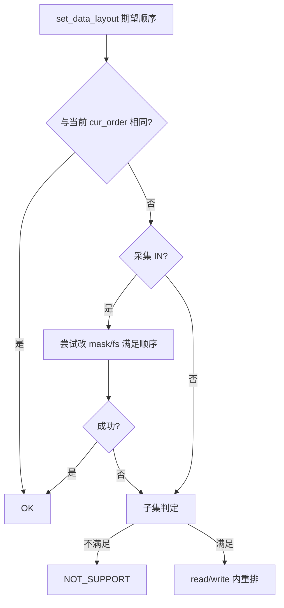

# `esp_codec_dev` 数据布局逻辑与 API

`data_layout/` 目录下与通道顺序、内存布局相关的说明共两篇：

- **本文**：术语、三层模型与 **代码实现** 的对应关系，`get_real_order` / 内部 fs→layout 解析 / `set_data_layout` 等行为与示例。
- **[memory_data_layout.md](./memory_data_layout.md)**：Codec 发送顺序、ESP32 I2S slot、`slot_mask`、DMA 打包等 **板级与硬件现象**。

---

## 1. 术语

| 术语 | 含义 |
|------|------|
| **逻辑声道** | 业务或数据手册中的声道编号，取值 1～8；存入 `esp_codec_dev_channel_map_t` 的字段值；`chN` 表示内存第 N 个位置 |
| **时隙 slot** | I2S/TDM 帧内的一个数据位置；与 `esp_codec_dev_sample_info_t` 的 `channel`、`channel_mask` 在驱动侧的映射相关 |
| **Layer1** | 给定 **声道数 + `esp_codec_dev_i2s_mode_t`** 时，codec 在 **全槽参与** 条件下逻辑声道到物理时隙的映射；由 `codec_if->hw_base.get_order_list()` 返回的 `esp_codec_dev_device_map_info_t` 描述 |
| **Layer2** | 在当前 **`channel` / `channel_mask` / data interface mode** 下，I2S 侧实际使能的 slot 及其内存位置→slot map；由 `data_if->get_mode()`、`data_if->get_order()` 与 `data_if->get_channel_mask()` 共同描述 |
| **Layer3** | DMA、位宽打包、单声道等导致的 **用户缓冲区** 与 slot 之间的差异；在 `esp_codec_dev_read` / `esp_codec_dev_write` 中处理，含 `set_data_layout` 触发的软件重排 |
| **channel map** | `esp_codec_dev_channel_map_t`：内存位置 N → slot/通道 ID。用 `ESP_CODEC_DEV_CHANNEL_MAP(...)` 构造，`.value` 低 4 bit 为内存第 1 个通道。恒等 stereo 为 `MAP(1,2)=0x21`；`FL,RE` 为 `MAP(1,3)=0x31`；旧序列 `0x1324` 对应 `MAP(1,3,2,4)=0x4231` |
| **`cur_order`** | 设备已 `open` 且格式有效时，由 Layer1+Layer2 合成并缓存的内存 channel map；可被 `set_data_layout` 与用户期望对齐，实现见 `src/esp_codec_dev.c` |

**三层关系简述**：Layer1 描述 codec 帧内逻辑声道怎么排；Layer2 描述当前 `fs` 下哪些 slot 以何种顺序进入控制器；Layer3 描述进内存后是否还有打包或软件重排。`esp_codec_dev.c` 内部的 fs→layout 解析只合并 Layer1 与 Layer2，不包含 Layer3。

---

## 2. 三层与代码实现

| 层 | 说明 | 代码中的主要依据 |
|----|------|------------------|
| **Layer1** | Codec 逻辑声道到总线物理时隙的映射 | `codec_if->hw_base.get_order_list()` → `esp_codec_dev_device_map_info_t`（`include/esp_codec_dev_types.h`） |
| **Layer2** | 在当前 **`channel` / `channel_mask` / data interface mode** 下，数据通路侧实际使能的时隙及其 map | `data_if->get_mode()` + `data_if->get_order()` / `data_if->get_channel_mask()`；I2S 实现见 `platform/audio_codec_data_i2s.c` |
| **Layer3** | 内存与总线映射不一致时的处理 | `esp_codec_dev_read` / `esp_codec_dev_write` 及关联转换 |

Layer1 的 **`map` 字段** 与 Layer2 计算得到的 data map 均为上述 **channel map**。

**对外写文档时**：Layer1 不要混入 `channel_mask`，不要写「DMA 第几个 int」；Layer2 已含 mask；Layer3 单独写 DMA/位宽/是否调用 `set_data_layout`。

---

## 3. 内部 fs→layout 解析

内部 fs→layout 解析在实现上：

1. 调用 `data_if->get_order()`，由 `(channel, channel_mask)` 计算 **data_map**（Layer2）；  
2. 从 `codec_if->hw_base.get_order_list` 取与 `(channel, mode)` 匹配的 **device_map**（Layer1）；  
3. 调用内部函数 **`codec_dev_order_resolve_memory_map(data_map, device_map)`**，得到内存侧 **channel map**。

该结果 **不替代 Layer3**。说明 **`read` 之后 buffer 里实际顺序** 时，若存在强平台相关的打包，须单独写 Layer3，并结合 [memory_data_layout.md](./memory_data_layout.md)。

---

## 4. 描述「实际 buffer 顺序」的推荐顺序

对外说明时建议按下面层级写清，再下结论：

1. **Layer1**：codec、模式、全槽时的布局序。  
2. **Layer2**：当前 `fs` 的 `channel`、`channel_mask` 与 data interface mode 下的总线有效布局序。  
3. **Layer3**（如适用）：DMA/位宽/芯片特例；是否使用 `esp_codec_dev_set_data_layout`。  
4. **结论**：`esp_codec_dev_read` 得到的缓冲中，各逻辑声道所在的内存位置；或与某 map `.value` 一致。

具体芯片数值以芯片数据手册、板级原理图以及各 `device/*/*.c` 中 `get_order_list` 表为准。

---

## 5. `esp_codec_dev_channel_map_t`

类型定义见 `include/esp_codec_dev_types.h`。`ESP_CODEC_DEV_CHANNEL_MAP(1, 3, 2, 4, 0, 0, 0, 0)` 表示内存位置 1..4 依次存放通道/slot ID 1,3,2,4（`.value == 0x4231`）。合法 map 须满足：从 `ch1` 起非零连续（无空洞）、无重复 ID、取值 1～8。

在 **Layer1+Layer2** 已由当前 `fs` 确定的前提下，布局 API 使用 **`esp_codec_dev_channel_map_t`** 声明 **希望在内存中得到的通道排列**：能硬件满足则改 `channel_mask` 或 `fs`；否则在符合子集关系时在 **读写路径** 做软件重排。

---

## 6. `esp_codec_dev_set_data_layout` 行为概要

须在 **`esp_codec_dev_open()` 之后**调用。流程如下：



- **采集 IN**：可先尝试通过调整 `channel_mask` 等满足目标顺序，失败后再做子集判定与软件重排。  
- **播放 OUT**：不做上述硬件重配尝试，直接子集判定后按需软件重排。  
- **`cur_order`**：由当前 `fs` 与 Layer1、Layer2 经内部 fs→layout 逻辑得到；若与实测 buffer 不一致，结合 [memory_data_layout.md](./memory_data_layout.md) 第三节分析 Layer3。

---

## 7. layout API 的分工与调用示例

| API | 作用 |
|-----|------|
| `esp_codec_dev_get_data_layout()` | 查询当前 effective layout；open 前依赖 data interface 当前格式与模式，open 后反映当前流格式和 `set_data_layout` 结果 |
| `esp_codec_dev_set_data_layout()` | 声明应用期望的 **内存中** 多声道顺序，并触发硬件路径或 `read`/`write` 内重排 |

**建议调用顺序**：配置并 init I2S →（可选）`get_data_layout` → `esp_codec_dev_open` → 如需再 `set_data_layout` → `read`/`write`。

`esp_codec_dev_set_data_layout()` 只能在设备 open 后调用。

参考示例：

```c
    esp_codec_dev_sample_info_t fs = {
        .sample_rate = 48000,
        .channel = 4,
        .bits_per_sample = 16,
        .mclk_multiple = 256,
        .channel_mask = 0x0F,
    };

    ret = esp_codec_dev_open(record_dev, &fs);
    TEST_ESP_OK(ret);

    fs.channel = 2;
    fs.channel_mask = BIT(0) | BIT(1);
    ret = esp_codec_dev_open(play_dev, &fs);
    TEST_ESP_OK(ret);

    esp_codec_dev_channel_map_t cur_map = {0};
    esp_codec_dev_get_data_layout(record_dev, &cur_map);

    /* Memory wants FL,RE => positions hold channel IDs 1 then 3 */
    esp_codec_dev_channel_map_t map = {
        .value = ESP_CODEC_DEV_CHANNEL_MAP(1, 3, 0, 0, 0, 0, 0, 0),
    };
    esp_codec_dev_set_data_layout(record_dev, &map);

    map.value = ESP_CODEC_DEV_CHANNEL_MAP(1, 2, 0, 0, 0, 0, 0, 0);
    esp_codec_dev_set_data_layout(play_dev, &map);
```

---

## 8. 使用注意

- 软件重排时，通道数、位宽和采样率越高，CPU 与内存带宽开销越大。

---

## 9. 源码位置

| 内容 | 路径 |
|------|------|
| layout 推导、校验和软件重排入口 | `src/esp_codec_dev.c` |
| I2S data interface 的模式与 order 查询 | `platform/audio_codec_data_i2s.c` |
| 各 codec 的 `hw_base.get_order_list` 实现 | `device/*/*.c` |
| order 类型与编码/解码工具 | `include/esp_codec_dev_types.h` |
| 公开布局 API | `include/esp_codec_dev.h` |
