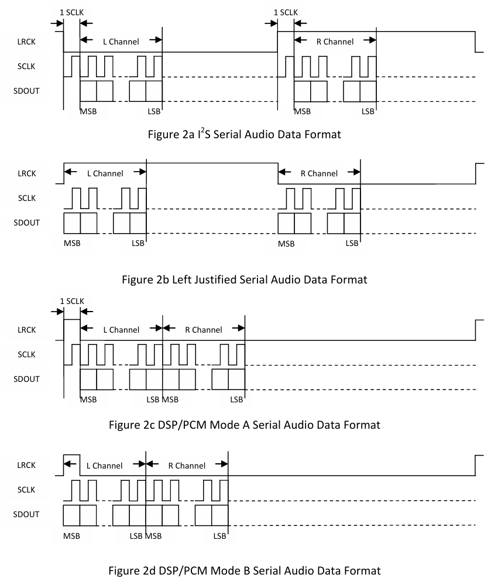
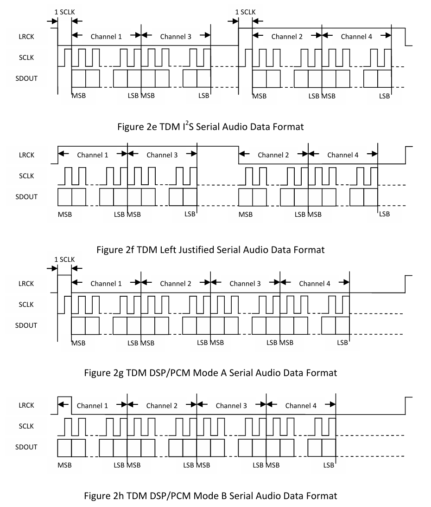
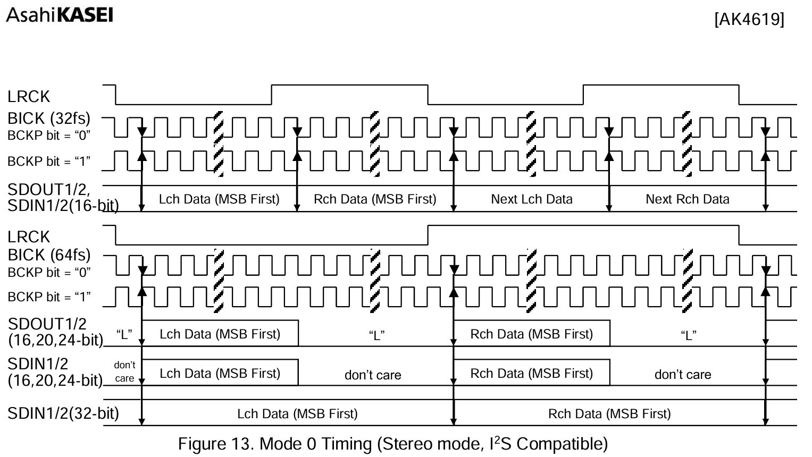
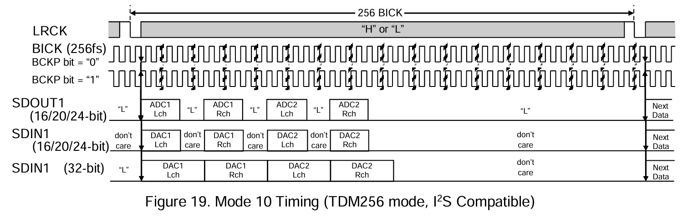
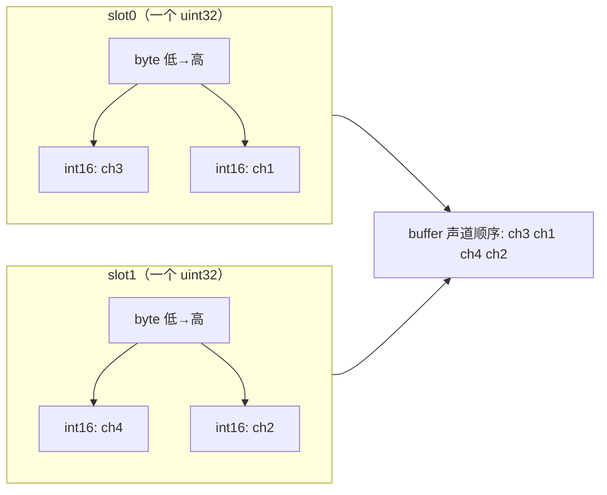
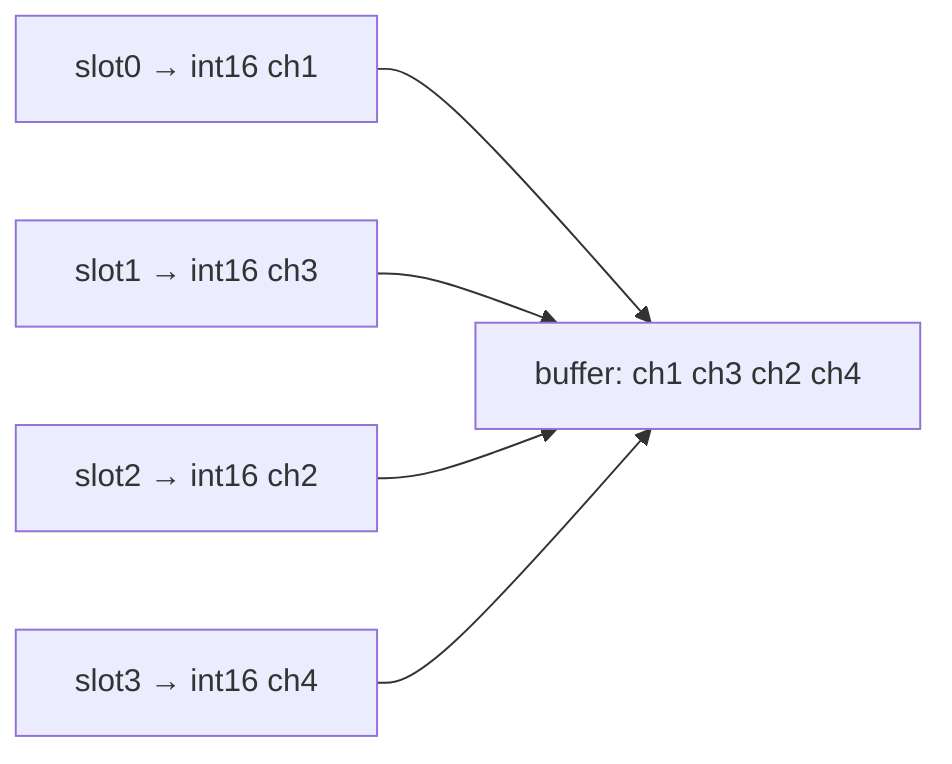

# 内存中的数据排布与 codec 物理通道关系

与 **`esp_codec_dev` 布局 API、Layer 术语及 `get_real_order`** 的对应说明见 [data_layout_logic.md](./data_layout_logic.md)。

内存中的数据排布与实际物理通道顺序的关系主要由以下三层顺序叠加而成：
1. Codec 实际发送顺序，如 通道1，通道2，通道3，通道4
2. I2S 驱动中从总线选择的通道，依据 slot_mask 而定，如 slot_mask = 0x03
3. 从总线中获取数据后，搬运到内存中的顺序，由 DMA 搬运顺序而定

---

## 1. Codec 实际发送顺序（简称 Layer1 层）

### 通道定义

Codec 芯片数据手册中引脚标注的实际物理通道顺序，定义如下：

1. ADC 常见引脚命名和本文使用的逻辑声道的关系

下表仅说明**不同 Codec 数据手册中的引脚/通道命名**与**本文统一使用的逻辑声道 ch1、ch2…**（与 [data_layout_logic.md](./data_layout_logic.md) 中「逻辑声道」一致）的对应关系，**不特指某一颗料号**；以具体芯片手册为准。

| 数据手册中的引脚或通道命名示例 | 对应本文逻辑声道 |
|-------------------------------|-----------------|
| AINLP, AINLN | ch1 |
| AINRP, AINRN | ch2 |
| LIN1，RIN1 | ch1 |
| LIN2，RIN2 | ch2 |
| MIC1P, MIC1N | ch1 |
| MIC4P, MIC4N | ch4 |
| IN1P_GPI1，IN1M_GPO1 | ch1 |
| IN4P_GPI4，IN4M_GPO4 | ch4 |
| ADC1_L | ch1 |
| ADC1_R | ch2 |
| ADC2_L | ch3 |
| ADC2_R | ch4 |

2. DAC 常见引脚命名和本文使用的逻辑声道的关系

| 数据手册中的引脚或通道命名示例 | 对应本文逻辑声道 |
|-------------------------------|-----------------|
| VOUT1 ~ VOUT8 | ch1 ~ ch8 |
| DAC1_L | ch1 |
| DAC1_R | ch2 |
| DAC2_L | ch3 |
| DAC2_R | ch4 |

**备注说明**：

以下两条描述的是**数据手册引脚/通道命名**与本文 **ch1、ch2…** 的**常见对应习惯**（多见于带 L/R 标注的立体声或多组 ADC/DAC 器件），**并非所有 Codec 的强制规则**，具体仍以**芯片数据手册**为准。

1. **双通道（立体声）**：通常 **左（L）对应 ch1**，**右（R）对应 ch2**。
2. **多通道（多组 ADC/DAC）**：常见做法是**先按组排序**（如 ADC1、ADC2…），**组内左声道先于右声道**（每组内 L 再 R），与上表「ADC1_L→ch1、ADC1_R→ch2、ADC2_L→ch3、ADC2_R→ch4」一致。

**与下文的关系**：本条只约定「**物理通道/引脚命名**」如何编号到 **ch1…**。

### 实际发送或者接收通道顺序

发送是指 ADC 路径（codec -> 总线），接收是指 DAC 路径（总线 -> codec）

1. **单通道或者立体声**
- 对于发送，则是将采集的 MIC 通道数据按顺序发送，即 ch1 是左声道，ch2 是右声道；
- 对于接收，则将从总线 slot 中获取的 PCM 数据给到对应 speaker，即左声道数据给到 VOUT1，右声道数据给到 VOUT2。
- 如果仅有单通道，则默认使用的是左通道：将 MIC 采集 ch1 的数据仅放在左声道中或者将从左声道获取的 PCM 数据通过 VOUT1 输出

2. **多通道传输**
- **TDM Philips 模式**：LRCK 高低电平各占一半，LRCK 为低时，发送/接收奇数通道数据，LRCK 为高时，发送/接收偶数通道数据
 - 实际顺序为 ch1 ch3 ch2 ch4，即先发送奇数通道数据，后发送偶数通道数据

- **TDM DSP/PCM 模式**：LRCLK 高电平占一个 BCLK 周期，低电平时顺次发送通道数据
 - 实际顺序为 ch1 ch2 ch3 ch4，即按照实际物理通道顺序发送或者接收

本文保留 DSP/PCM 时序作为底层 I2S 与 codec 手册的参考；`esp_codec_dev_sample_info_t` 不承载 I2S mode，STD/TDM/PDM 模式由 data interface 从底层 I2S channel 查询。

3. **参考示例**

- **ES7210 STD 2 通道**：  


- **ES7210 TDM 4 通道**：  


- **AK4619 STD 2 通道**：  


- **AK4619 TDM 4 通道**：  


---


## 2. ESP32 系列芯片 I2S 驱动收发顺序（简称 Layer2 层）

### 通道定义

ESP32 通道定义是以 slot 为定义的（slot0 -> ch1， slot1 -> ch2），实际定义如下：

#### SOC_I2S_HW_VERSION_1

第一代 I2S 硬件（ESP32 和 ESP32S2），不支持 TDM 模式，可以支持 STD 模式，仅有两个 slot。

- **STD Philips 模式**：默认在 LRCK 为低时是 slot0，在 LRCK 为高时是 slot1
- **STD PCM 模式**：默认 LRCK 高电平持续一个 BCLK 周期，然后在低电平期间按顺序持续发送 slot0 slot1

#### SOC_I2S_HW_VERSION_2

第二代 I2S 硬件，可以支持 STD 模式和 TDM 模式，且 TDM 模式兼容 STD 模式。

- **TDM Philips 模式**：在 LRCK 为低时，依次为 slot0 slot1，在 LRCK 为高时，依次为 slot2 slot3
 - 详见如下时序：
 - 如果是 STD Philips，则在 LRCK 为低时是 slot0，在 LRCK 为高时是 slot1
- **TDM PCM 模式**：LRCK 高电平持续一个 BCLK 周期，然后在低电平期间按顺序持续发送
 - 详见如下时序：
 - 此时顺序依次是 slot0 slot1 slot2 slot3

**备注**
- 总线收发 slot 均按顺序执行，如四通道时是 slot0 slot1 slot2 slot3
- 对于接收，可以使用 slot_mask 选择对应的通道通过 DMA 保存到内存中，如 slot_mask = 0x07，则从总线上选择 slot0 slot1 slot2 保存到内存中
- 对于发送，可以使用 slot_mask 将内存中的数据通过 DMA 发送到对应总线上，如 slot_mask = BIT(1) | BIT(3)，则会将内存中两通道数据发送到 slot1 和 slot3 中

---

## 3. ESP32 DMA 相关顺序（简称 Layer3 层）

依赖 STD/单声道/位宽等条件，导致与总线 slot 时间序不一致的内存布局。

### ESP32 本身 DMA 顺序问题

- 单通道位深是 8bit/16bit 时，实际接收的顺序会反转。如同一声道内连续四个 16bit 样本在总线上传输的样本顺序为 S1 S2 S3 S4，则在实际内存中的顺序为 S2 S1 S4 S3
- 单通道位深是 8bit/16bit 时，实际发送的顺序也会反转，如同一声道内连续四个 16bit 样本在内存中排序为 S1 S2 S3 S4，则总线上发送在左声道的数据顺序为 S2 S1 S4 S3。

### 采集 4ch 16bit 数据实际通道顺序问题

**背景**：Codec 侧始终是 **TDM Philips、4 路 16bit** 按时序发到总线上；差异在 **ESP32 I2S 如何把比特流解包进 DMA**（「一帧几个 slot、每个样本几 bit」）。下面 **A / B 两种驱动配置**下，从总线到 **buffer 里声道的先后顺序**不同，尤其是 **A 会在每个 32bit 字内产生 RMNM 式的成对交换**，**B 则与 slot 顺序一致**。

| 配置 | 驱动眼里的「一帧」 | 每个 slot 在内存中占多少 | 典型场景 |
|------|-------------------|---------------------------|----------|
| **A：2ch × 32bit** | 只有 **2 个 slot**；每个 slot 被当成 **一个 32bit 样本**（内含两路 16bit） | 每声道周期 **1×uint32**（4 字节）包住两路 16bit | 芯片只开 STD、或 TDM 里仍按 **2 通道 32bit** 去接 4×16bit |
| **B：4ch × 16bit** | **4 个 slot**；每个 slot **一路 16bit** | 每路 **1×uint16**（2 字节），与总线语义一致 | 正常 TDM 四通道采集 |

下面假设 Codec 在总线上 **MSB 先** 发 16bit 数据；ESP32 内存为 **小端**（低地址存 LSB 字节）。

---

#### 配置 A：2ch × 32bit —— 每个 slot 内两路 16bit 在内存里「成对交换」

总线在 **一个 slot 周期**内串行移入的是：**先 ch1 的 16bit，再 ch3 的 16bit**（同一 slot 里叠两路）：

```text
时间序（MSB→LSB）:  [ ch1 的 16bit ] [ ch3 的 16bit ]
                    └──── slot0 上的一整个 32bit 周期 ────┘
```

驱动按 **32bit 一字** 取进 DMA。小端下，该字 4 个字节从低地址到高地址为（与总线上「先 ch1 后 ch3」相比，**两路 16bit 在同一 uint32 内前后对调**）：

```text
地址 ↑   byte0      byte1      byte2      byte3
        ch3_LSB    ch3_MSB    ch1_LSB    ch1_MSB
```

把相邻两字节各看成 **little-endian int16**，则该 uint32 内先后两个样本是 **ch3 → ch1**（与总线上先 ch1 后 ch3 相反）。slot1 同理为 **ch4 → ch2**。四个声道在 buffer 里连起来即：

**ch3 → ch1 → ch4 → ch2**（即 es7210 常见的 **RMNM** 排列）。



---

#### 配置 B：4ch × 16bit —— 每个 slot 一路 16bit，与总线一致

总线：**slot0=ch1，slot1=ch3，slot2=ch2，slot3=ch4**（每 slot 只含一路 16bit）。

```text
slot0: ch1_MSB…ch1_LSB   slot1: ch3_MSB…ch3_LSB   slot2: ch2_MSB…ch2_LSB   slot3: ch4_MSB…ch4_LSB
```

DMA 按 **每路 16bit** 落盘，小端下每个声道仍是 **LSB 在低地址**，buffer 里 **int16 顺序与 slot 顺序一致**：

```text
ch1_LSB ch1_MSB | ch3_LSB ch3_MSB | ch2_LSB ch2_MSB | ch4_LSB ch4_MSB
        ch1           ch3               ch2               ch4
```

即 **ch1 → ch3 → ch2 → ch4**，与上文「Codec 在 TDM Philips 下先发 slot0/1 再发 slot2/3」的**声道序一致**，无 RMNM 交换。



---

**小结**：差别不在 Codec 总线，而在 **I2S 是否把「同一 slot 周期内的两路 16bit」合成一个 32bit 字读入**。合成读入时，会与「按 4 路 16bit 分 slot 读入」得到不同的内存声道序；与第 4 节表格中「2ch 32bit 采集 → RMNM」对应。

---

## 4. 叠加后顺序

实际内存顺序是三层叠加后的结果，以下为相关示例：

### TDM Philips 4ch

1. Codec 在总线上发送的顺序：ch1 ch3 ch2 ch4
2. I2S Driver 采集顺序：
 - slot_mask = 0x03，则选择 slot0 和 slot1，得到 ch1 ch3
 - slot_mask = 0x07，则选择 slot0, slot1, slot2，得到 ch1 ch3 ch2
 - slot_mask = 0x0F，则选择 slot0, slot1, slot2, slot3，得到 ch1 ch3 ch2 ch4
3. DMA 顺序：
 - 如果使用 2ch 32bit 采集 4ch 16bit，则总线上获取的数据会进行交换，得到 ch3 ch1 ch4 ch2
 - 如果正常使用 TDM，则不会进行交换，直接得到 ch1 ch3 ch2 ch4

### TDM PCM 4ch

1. Codec 在总线上发送的顺序：ch1 ch2 ch3 ch4
2. I2S Driver 采集顺序：
 - slot_mask = 0x03，则选择 slot0 和 slot1，得到 ch1 ch2
 - slot_mask = 0x07，则选择 slot0, slot1, slot2，得到 ch1 ch2 ch3
 - slot_mask = 0x0F，则选择 slot0, slot1, slot2, slot3，得到 ch1 ch2 ch3 ch4
3. DMA 顺序：
 - 如果使用 2ch 32bit 采集 4ch 16bit，则总线上获取的数据会进行交换，得到 ch2 ch1 ch4 ch3
 - 如果正常使用 TDM，则不会进行交换，直接得到 ch1 ch2 ch3 ch4

### TDM/STD Philips/PCM 2ch

1. Codec 在总线上发送的顺序：ch1 ch2
2. I2S Driver 采集顺序：
 - slot_mask = 0x01，则选择左声道（slot0），得到 ch1
 - slot_mask = 0x02，则选择右声道（slot1），得到 ch2
 - slot_mask = 0x03，则选择左声道（slot0）和右声道（slot1），得到 ch1 ch2
3. DMA 顺序：
 - 一般情况下均不需要发生改变，仅有 ESP32 单声道下需要交换数据
