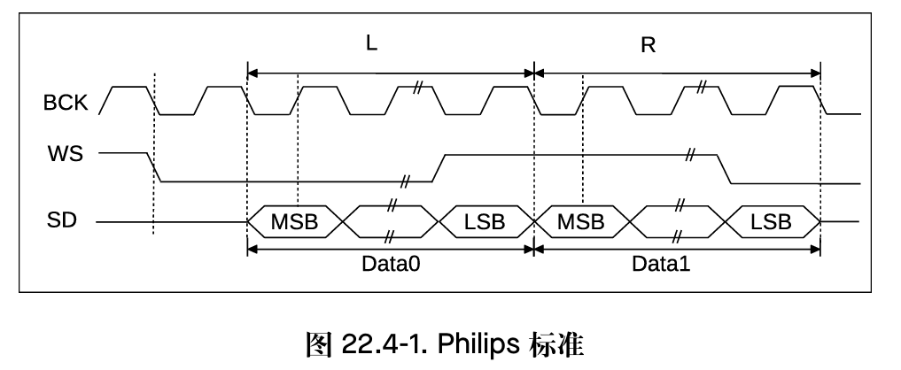
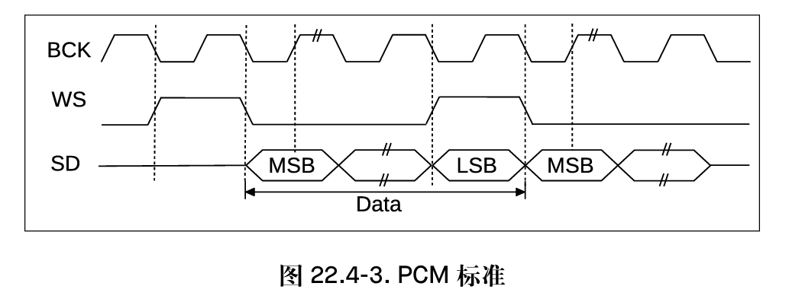
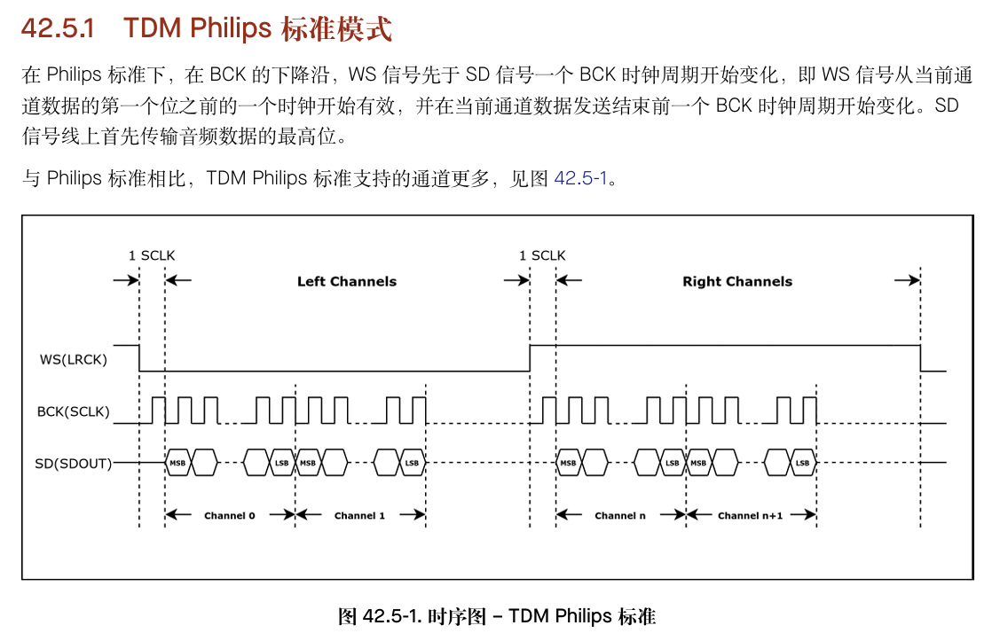
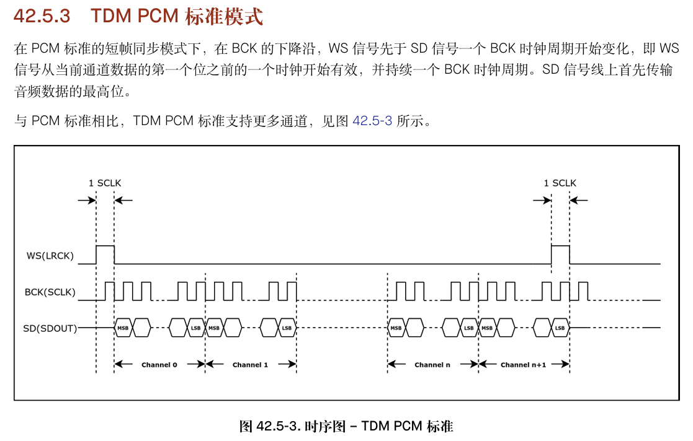
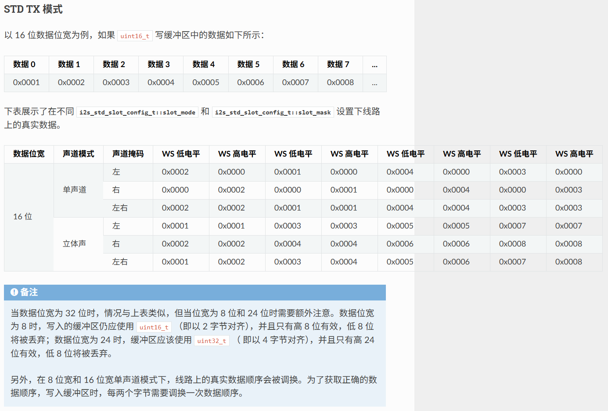
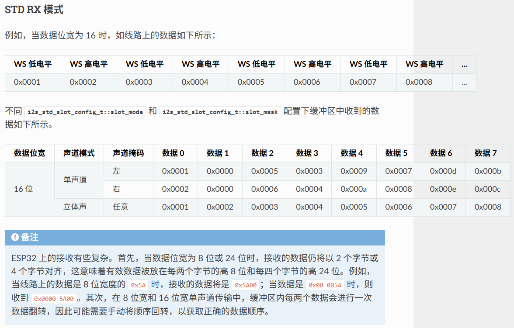

# ESP32 I2S 相关应用与概念

本文说明 ESP32 系列 I2S 的常见模式、数据位宽、slot、时钟和全双工行为。与 **多声道内存布局、L1/L2/L3** 及 `esp_codec_dev_channel_map_t`、布局 API 相关的说明见 [`../data_layout/data_layout_logic.md`](../data_layout/data_layout_logic.md)；Codec 与 DMA 顺序叠加见 [`../data_layout/memory_data_layout.md`](../data_layout/memory_data_layout.md)。

## I2S 模式

### STD Philips 标准模式

STD Philips 模式使用标准 I2S 时序，数据相对 WS 边沿延迟 1 个 BCLK 后开始传输。



### STD PCM 标准模式

STD PCM 模式用于 PCM/DSP 类时序，通常通过 `ws_width` 和 `bit_shift` 控制帧同步与数据对齐。本文保留该时序图作为底层 I2S 行为参考；`esp_codec_dev_sample_info_t` 不承载 I2S mode，STD/TDM/PDM 模式由 data interface 从底层 I2S channel 查询。



### TDM Philips 标准模式

TDM Philips 模式在一个 WS 周期内承载多个 slot，slot 内数据仍按 Philips 时序对齐。



### TDM PCM 标准模式

TDM PCM 模式适合多通道 codec 连续输出或接收多个 slot 的场景，可通过短帧或长帧方式同步帧边界。本文保留该时序图作为底层 I2S 行为参考；`esp_codec_dev_sample_info_t` 不承载 I2S mode，实际模式由 data interface 从底层 I2S channel 查询。



### 参考资料

[esp32_technical_reference_manual_cn](https://documentation.espressif.com/esp32_technical_reference_manual_cn.pdf)  
[esp32-s3_technical_reference_manual_cn](https://documentation.espressif.com/esp32-s3_technical_reference_manual_cn.pdf)

## I2S 特性

### 数据存放顺序和实际发送顺序

[ESP32 I2S STD TX 详细说明](https://docs.espressif.com/projects/esp-idf/zh_CN/latest/esp32/api-reference/peripherals/i2s.html#std-tx)




1. 在 8 位宽和 16 位宽单声道模式下，线路上的真实数据顺序会被调换。为了获取正确的数据顺序，写入缓冲区时，每两个字节需要调换一次数据顺序。
2. 用户缓冲区必须是 16bit（实际数据为 8bit（高 8 位有效，低 8 位将被丢弃） 或者 16bit）或者 32bit（实际数据为 24bit（高 24 位有效，低 8 位将被丢弃） 或者 32bit）

### 相关概念

1. `i2s_data_bit_width_t data_bit_width`： 内存中实际存放的数据，每个采样有多少位有效数据
2. `i2s_slot_bit_width_t slot_bit_width`： I2S 总线中每个通道采样预留多少位（有效数据 + 填充），影响到时钟和总线时序
3. `i2s_std_slot_mask_t slot_mask`： 用于选择哪些 slot 数据接收/发送到内存中
4. `uint32_t sample_rate_hz`： 每秒每个通道采集的次数
5. `i2s_clock_src_t clk_src`： 时钟源，如需要降低功耗，可选 XTAL

## I2S 共享总线

### 主从模式

I2S 主从角色决定 BCLK、WS 等时钟信号由谁输出：

- `I2S_ROLE_MASTER`：ESP32 输出 BCLK、WS，可根据配置输出 MCLK。
- `I2S_ROLE_SLAVE`：ESP32 接收外部设备提供的 BCLK、WS。
- 全双工使用同一 I2S 端口时，TX 和 RX 共享 BCLK、WS，因此应使用一致的时钟和 slot 配置。
- 在 ESP-IDF v6.0 及以上版本中，先初始化的通道保持 Master 角色，后初始化的通道作为 Slave 使用。

推荐同时创建 TX/RX 通道，并固定初始化顺序。如果需要维护旧版本 ESP-IDF 项目，可参考 [I2S 旧版本差异说明](./i2s_compatibility_guide.md)。

### I2S_STD 和 TDM 模式混用

详见：[不同模式间混合使用](./i2s_tdm_std_mixmode_guide.md)


### TDM 配置要点

```c
// SOC_I2S_HW_VERSION_2
typedef struct {
    /* General fields */
    i2s_data_bit_width_t    data_bit_width;     /*!< I2S sample data bit width (valid data bits per sample) */
    i2s_slot_bit_width_t    slot_bit_width;     /*!< I2S slot bit width (total bits per slot) */
    i2s_slot_mode_t         slot_mode;          /*!< Set mono or stereo mode with I2S_SLOT_MODE_MONO or I2S_SLOT_MODE_STEREO */

    /* Particular fields */
    i2s_tdm_slot_mask_t     slot_mask;          /*!< Slot mask. Activating slots by setting 1 to corresponding bits. When the activated slots is not consecutive, those data in inactivated slots will be ignored */
    uint32_t                ws_width;           /*!< WS signal width (i.e. the number of BCLK ticks that WS signal is high) */
    bool                    ws_pol;             /*!< WS signal polarity, set true to enable high lever first */
    bool                    bit_shift;          /*!< Set true to enable bit shift in Philips mode */

    bool                    left_align;         /*!< Set true to enable left alignment */
    bool                    big_endian;         /*!< Set true to enable big endian */
    bool                    bit_order_lsb;      /*!< Set true to enable lsb first */

    bool                    skip_mask;          /*!< Set true to enable skip mask. If it is enabled, only the data of the enabled channels will be sent, otherwise all data stored in DMA TX buffer will be sent */
    uint32_t                total_slot;         /*!< I2S total number of slots. If it is smaller than the biggest activated channel number, it will be set to this number automatically. */
} i2s_tdm_slot_config_t;
```

#### 影响内存中存储大小、顺序、通道数的配置：`data_bit_width  slot_mode  slot_mask  skip_mask`
#### 影响数据总线时序和通道的配置：`slot_bit_width slot_mask ws_width ws_pol bit_shift left_align big_endian bit_order_lsb total_slot`

**data_bit_width**
1. 实际采集数据的位深，主要影响**每个采样点在内存中占用的空间**，如位深是 8/16/24/32 bit，则每个采样点分别占用 1/2/3/4 字节
2. 数据位宽为 8/16/32 位时，缓冲区的类型最好为 uint8_t/uint16_t/uint32_t
3. 数据位宽为 24 位时，数据缓冲区应该以 3 字节对齐，即每 3 个字节代表一个 24 位数据，并且 `i2s_chan_config_t::dma_frame_num`（默认 240）、 `i2s_tdm_clk_config_t::mclk_multiple`（默认 256） 和写缓冲区的大小应该为 3 的倍数。此外当配置位深 24bit 时 codec 输出也是 24bit slot，因此也无法使用如下配置：`mclk_multiple = 256 && data_bit_width = 24 && slot_bit_width = 32`

**slot_bit_width**
1. 一个声道中的 BCLK 时钟周期数量，如 8/16/24/32，而 `BCLK = sample_rate_hz * total_slot * slot_bit_width`
2. 宽度限制条件：`slot_bit_width >= data_bit_width`
3. 组成全双工时，收发通道的 `BCLK` 和 `sample_rate_hz` 必须一致，因此可通过调节 `slot_bit_width` 实现不同 `total_slot` 下的匹配，如 `4ch * 16bit = 2ch * 32bit`

**slot_mode**
1. 实际影响的是**内存中存放数据的排列格式**，如 `I2S_SLOT_MODE_MONO` 模式表示内存中相邻数据是同一个通道的相邻采样点。 而 `I2S_SLOT_MODE_STEREO` 模式下相邻数据是不同通道的（同一时刻）采样点。**除非想要节省内存或者多音频广播，否则不建议使用 I2S_SLOT_MODE_MONO 模式**
2. `I2S_SLOT_MODE_MONO`
- 用于发送时，则将内存中的单个数据通过 `slot_mask` 同时多通道发送数据，实现多个播放设备同时播放相同音乐。如内存中数据为 `0x1234 0x5678`，而 `slot_mask = BIT(2) | BIT(3)`，则会将该单声道数据同时发送在第 3、4 通道。如果 `slot_mask = BIT(0)`，则仅在第 1 通道发送数据，其余通道数据为 0。
- 用于接收时，**实际存放通道数为单声道**，不管 `slot_mask` 设置多少，仅取第一个 slot 数据。如数据总线上接收到 4 通道数据：`ch1_1 ch2_1 ch3_1 ch4_1 ch1_2 ch2_2 ch3_2 ch4_2`，实际内存中得到的数据为 `ch1_1 ch1_2`。
3. `I2S_SLOT_MODE_STEREO`
- 用于发送时，当 `skip_mask = false && slot_mask = BIT(2) | BIT(3)` 时（此时 `total_slot = 4`），则内存地址中需要按照 `ch3 ch4 ch3 ch4` 方式排列，每次发送两个通道，且将数据发送在第 3 和 4 通道上。
- 用于发送时，当 `skip_mask = true && slot_mask = BIT(2) | BIT(3)` 时（此时 `total_slot = 4`），则内存地址中需要按照 `dummy dummy ch3 ch4 dummy dummy ch3 ch4` 方式排列，发送两通道数据，且发送在第 3 和 4 通道上。
- `total_slot` 默认设置为 `slot_mask` 最高位，如 `slot_mask = BIT(2)`，此时 `total_slot = 3`，则**需要手动设置为偶数通道（total_slot = 4）数以适配 codec 行为**。
- 用于接收时，如 `total_slot = 4 && slot_mask = BIT(0) | BIT(1) | BIT(2)` 可将 4 通道中第 1、2、3 通道数据按顺序接收到内存中，实际存放顺序为 `ch1 ch2 ch3 ch1 ch2 ch3`

**slot_mask**
1. 发送时，表示待发送到总线上的数据通道，如 `total_slot = 4 && slot_mask = BIT(2) | BIT(3)`，则会将数据发送在第 3、4 通道上。
2. 接收时，表示从总线接收的通道中选择特定的通道保存在内存中，如 `total_slot = 4 && slot_mask = BIT(2) | BIT(3)`，则会将总线的第 3、4 通道数据按顺序保存在内存中。在 `I2S_SLOT_MODE_MONO` 模式下，只能接收第一个 slot 数据，无法通过 `slot_mask` 进行选择。
3. 当 `skip_mask = true` 时，从内存中读取的数据通道数据必须和 `total_slot` 一致，建议保留 false 。

**skip_mask**
1. **仅在 TDM TX时生效，不建议使能，默认为 false**
2. 当设置 true 时，实际内存中数据排布要和 `total_slot` 一致，如 `total_slot=4`，则待发送数据必须是 4 通道排布，未使用的通道也要进行填充，如 `dummy ch2 ch3 ch4`，此时可以通过 `slot_mask = BIT(2) | BIT(3)` 选择第 3 和 4 通道数据进行发送

**total_slot**
1. 默认依赖于 `slot_mask`，**建议手动配置为偶数通道**

**DSP/PCM 模式**
1. 只有在 DSP/PCM 模式下，codec 才会连续发送通道数据，如 `ch1 ch2 ch3 ch4`，默认 TDM Philips 模式下，通道顺序为 `ch1 ch3 ch2 ch4`，即先发左声道数据，后发右声道数据。
2. `I2S_TDM_PCM_SHORT_SLOT_DEFAULT_CONFIG()` 是 ESP-IDF TDM PCM 时序配置参考；`esp_codec_dev_sample_info_t` 不单独暴露 `TDM_PCM` 模式。


### STD 配置要点

**以 SOC_I2S_HW_VERSION_1 （ESP32 和 ESP32S2）硬件版本（无法支持 TDM 模式）进行解释，而 SOC_I2S_HW_VERSION_2 版本和 TDM 模式下基本表现一致**

```c
typedef struct {
    /* General fields */
    i2s_data_bit_width_t    data_bit_width;     /*!< I2S sample data bit width (valid data bits per sample) */
    i2s_slot_bit_width_t    slot_bit_width;     /*!< I2S slot bit width (total bits per slot) */
    i2s_slot_mode_t         slot_mode;          /*!< Set mono or stereo mode with I2S_SLOT_MODE_MONO or I2S_SLOT_MODE_STEREO
                                                 *   In TX direction, mono means the written buffer contains only one slot data
                                                 *   and stereo means the written buffer contains both left and right data
                                                 */

    /* Particular fields */
    i2s_std_slot_mask_t     slot_mask;          /*!< Select the left, right or both slot */
    uint32_t                ws_width;           /*!< WS signal width (i.e. the number of BCLK ticks that WS signal is high) */
    bool                    ws_pol;             /*!< WS signal polarity, set true to enable high lever first */
    bool                    bit_shift;          /*!< Set to enable bit shift in Philips mode */
#if SOC_I2S_HW_VERSION_1    // For esp32/esp32-s2
    bool                    msb_right;          /*!< Set to place right channel data at the MSB in the FIFO */
#else
    bool                    left_align;         /*!< Set to enable left alignment */
    bool                    big_endian;         /*!< Set to enable big endian */
    bool                    bit_order_lsb;      /*!< Set to enable lsb first */
#endif
} i2s_std_slot_config_t;
```

**data_bit_width**
1. 实际采集数据的位深，主要影响**每个采样点在内存中占用的空间**，如位深是 16bit，则每个采样点使用 2 字节存储，数据位深 32bit，则使用 4 字节存储
2. 数据位宽为 8 时，写入的缓冲区仍应使用 uint16_t （即以 2 字节对齐），并且只有高 8 位有效，低 8 位将被丢弃。**仅针对 ESP32，ESP32S2 推荐使用 uint8_t**
3. 数据位宽为 24 时，缓冲区应该使用 uint32_t （ 即以 4 字节对齐），并且只有高 24 位有效，低 8 位将被丢弃。**仅针对 ESP32，ESP32S2 推荐使用 3字节对齐内存**
4. 在 8 位宽和 16 位宽单声道模式下，线路上的真实数据顺序会被调换。**仅针对 ESP32，不推荐在 8bit 和 16bit 下使用单通道模式，应当使用立体声模式**
5. 由于 `total_slot == 2`，因此只能采集 2 通道数据。部分 ESP32 第一代 I2S 硬件场景可以配置 2ch 32bit 来承载 4ch 16bit 数据；若 codec 按 TDM Philips 顺序输出 4 路 16bit，典型内存排布为 `ch3 ch1 ch4 ch2`，具体仍需结合 codec 时序和目标芯片验证。

**slot_bit_width**
1. 一个声道中的 BCLK 时钟周期数量，如 8/16/24/32，而 `BCLK = sample_rate_hz * 2 * slot_bit_width`
2. 宽度限制条件：`slot_bit_width >= data_bit_width`
3. 组成全双工时，收发通道的 `BCLK` 和 `sample_rate_hz` 必须一致，因此 `slot_bit_width` 必须一致，而 `data_bit_width` 可不同。如播放 2ch 16bit，采集 4ch 16bit 时，需要如下配置：播放通道：`data_bit_width = 16 && slot_bit_width = 32`，采集通道：`data_bit_width = 32 && slot_bit_width = 32`

**slot_mode**
1. 实际影响的是**内存中存放数据的排列格式**，如 `I2S_SLOT_MODE_MONO` 模式表示内存中相邻数据是同一个通道的相邻采样点。 而 `I2S_SLOT_MODE_STEREO` 模式下相邻数据是不同通道的（同一时刻）采样点。**除非想要节省内存或者多音频广播，否则不建议使用 I2S_SLOT_MODE_MONO 模式**
2. `I2S_SLOT_MODE_MONO`
- **不建议在 ESP32 上使用单声道，因为内存排列顺序不符合实际逻辑**
- 用于发送时，则将内存中的单个数据通过 `slot_mask` 同时多通道发送数据，如果 `slot_mask = BIT(1)`，则仅在右声道发送数据，左声道数据为 0。
- 用于接收时，**实际存放通道数为单声道**，不管 `slot_mask` 设置多少，仅取左声道数据。如数据总线上接收到 4 通道数据：`L1 R1 L2 R2`，实际内存中得到的数据为 `L1 L2`。
3. `I2S_SLOT_MODE_STEREO`
- 内存中必须按照两通道排列
- 用于发送时，当 `slot_mask = BIT(1)` 时，则内存地址中需要按照 `dummy R1 dummy R2` 方式排列，每次只发送右声道数据
- 用于接收时，如 `slot_mask = BIT(1)` 可将右通道数据按顺序接收到内存中，实际存放顺序为 `R1 R2`

### I2S 时钟配置要点

```c
typedef struct {
    /* General fields */
    uint32_t                sample_rate_hz;     /*!< I2S sample rate */
    i2s_clock_src_t         clk_src;            /*!< Choose clock source, see `soc_periph_i2s_clk_src_t` for the supported clock sources.
                                                 *   selected `I2S_CLK_SRC_EXTERNAL` (if supports) to enable the external source clock inputted via MCLK pin,
                                                 *   please make sure the frequency inputted is equal or greater than `sample_rate_hz * mclk_multiple`
                                                 */
    uint32_t                ext_clk_freq_hz;    /*!< External clock source frequency in Hz, only take effect when `clk_src = I2S_CLK_SRC_EXTERNAL`, otherwise this field will be ignored
                                                 *   Please make sure the frequency inputted is equal or greater than BCLK, i.e. `sample_rate_hz * slot_bits * slot_num`
                                                 */
    i2s_mclk_multiple_t     mclk_multiple;      /*!< The multiple of MCLK to the sample rate, only take effect for master role */
    uint32_t                bclk_div;           /*!< The division from MCLK to BCLK, only take effect for slave role, it shouldn't be smaller than 8. Increase this field when data sent by slave lag behind */
} i2s_tdm_clk_config_t;
```

**sample_rate_hz**
1. I2S 采样率，表示每秒每个通道采集数。采样率越高，则音质相对较好，需要的内存也越多

**clk_src**
1. 详见 `soc_periph_i2s_clk_src_t`
2. `SOC_MOD_CLK_PLL_F160M`：一般默认使用 160M 时钟作为时钟源
3. `SOC_MOD_CLK_APLL`：如需降低输出时钟抖动，可以使用该时钟源，但是多个外设无法同时配置
4. `SOC_MOD_CLK_XTAL`：如需降低功耗，则可以使用该时钟源，并降低采样率等

**mclk_multiple**
1. 相关计算：`MCLK = sample_rate_hz * mclk_multiple`
2. 常见为 `I2S_MCLK_MULTIPLE_128、I2S_MCLK_MULTIPLE_192、I2S_MCLK_MULTIPLE_256、I2S_MCLK_MULTIPLE_384`

**bclk_div**
1. 可用于单独 slave 时，结合 master 配置
2. `MCLK = bclk_div * BCLK`
3. `BCLK = sample_rate_hz * total_slot * slot_bit_width`

**ext_clk_freq_hz**
1. 可用于配置外部时钟源

#### 时钟抖动问题

I2S MCLK 时钟由 source clk 分频而来，BCLK 和 sample_rate_hz 均由 MCLK 整数分频而来。然而如果 MCLK_DIV = source_clk / MCLK 不是整数分频，则会出现 MCLK 时钟抖动问题，参考 `双模前置小数分频器`。下面以 sample_rate_hz = 48000，mclk_multiple = 384 为例，展示不同时钟源下实际抖动情况。

**默认 160M 时钟源**
1. 选择时钟源：默认 SOC_MOD_CLK_PLL_F160M ，使用 160M 时钟进行分频
2. 计算 MCLK = sample_rate_hz * mclk_multiple = 48000 * 384 = 18432000
3. 计算分频系数： 160000000 / 18432000 = 8.681
4. 时钟抖动概率： (0.5 - (0.681 - 0.5)) / 0.5 = 63.8%

**APLL 时钟源**
1. 选择时钟源（需要 SOC_I2S_SUPPORTS_APLL 支持）：使用 SOC_MOD_CLK_APLL
2. 计算 MCLK = sample_rate_hz * mclk_multiple = 48000 * 384 = 18432000
3. 计算实际时钟源频率： rtc_clk_apll_coeff_calc()，得到实际的时钟为 18432006
4. 计算分频系数： 18432006 / 18432000 = 1.00
5. 时钟抖动概率： 无抖动

**APLL 时钟源使用问题：**
1. 同一个 PORT 上的 TX 和 RX 被认为是两个不同外设，均会引用计数，导致一旦两者同时使用该时钟源，则无法动态调节时钟
2. 问题解决方式一：master 使用 APLL 时钟源，slave 使用其他时钟源，如 XTAL，PLL 等
3. 问题解决方式二：I2S 驱动支持同 PORT 下仅 master 占用，slave 不占用

### I2S 通道配置要点

```c
typedef struct {
    i2s_port_t          id;                 /*!< I2S port id */
    i2s_role_t          role;               /*!< I2S role, I2S_ROLE_MASTER or I2S_ROLE_SLAVE */

    /* DMA configurations */
    uint32_t            dma_desc_num;       /*!< I2S DMA buffer number, it is also the number of DMA descriptor */
    uint32_t            dma_frame_num;      /*!< I2S frame number in one DMA buffer. One frame means one-time sample data in all slots,
                                             *   it should be the multiple of `3` when the data bit width is 24.
                                             */
    union {
        bool            auto_clear;         /*!< Alias of `auto_clear_after_cb` */
        bool            auto_clear_after_cb; /*!< Set to auto clear DMA TX buffer after `on_sent` callback, I2S will always send zero automatically if no data to send.
                                             *   So that user can assign the data to the DMA buffers directly in the callback, and the data won't be cleared after quit the callback.
                                             */
    };
    bool                auto_clear_before_cb; /*!< Set to auto clear DMA TX buffer before `on_sent` callback, I2S will always send zero automatically if no data to send
                                             *   So that user can access data in the callback that just finished to send.
                                             */
    bool                allow_pd;           /*!< Set to allow power down. When this flag set, the driver will backup/restore the I2S registers before/after entering/exist sleep mode.
                                             * By this approach, the system can power off I2S's power domain.
                                             * This can save power, but at the expense of more RAM being consumed.
                                             */
    int                 intr_priority;      /*!< I2S interrupt priority, range [0, 7], if set to 0, the driver will try to allocate an interrupt with a relative low priority (1,2,3) */
} i2s_chan_config_t;

#define I2S_CHANNEL_DEFAULT_CONFIG(i2s_num, i2s_role) { \
    .id = i2s_num, \
    .role = i2s_role, \
    .dma_desc_num = 6, \
    .dma_frame_num = 240, \
    .auto_clear_after_cb = false, \
    .auto_clear_before_cb = false, \
    .allow_pd = false, \
    .intr_priority = 0, \
}
```

**id**
1. 表示当前在哪个 port 端口注册，一般为 0 和 1

**role**
1. 表示以 master 还是 slave 注册。如果是 slave，则无法输出 MCLK、BCLK、LRCK，只能被动接收
2. TX 作为 slave 时，bclk_div 至少大于 6 才能稳定，推荐大于 8

**dma_desc_num**
1. DMA 描述符数量。数量越多，则缓存越多，不容易丢失数据，但是消耗内存也越多

**dma_frame_num**
1. 在一个 DMA 中缓存的帧数
2. 一个 DMA 最多缓存 4092bytes 数据，即 dma_frame_num * data_bit_width / 8 * active_slot <= 4092

#### I2S 内存占用估算

1. dma_frame_bytes = data_bit_width / 8 * active_slot = 16 / 8 * 4 = 8bytes
2. total_dma_bytes = dma_frame_bytes * dma_frame_num * dma_desc_num = 8 * 240 * 6 = 11520bytes

**备注**
1. 限制条件：dma_frame_bytes * dma_frame_num <= 4092
2. 目前使用的都是 SRAM，不是 PSRAM。**后续驱动会支持直接使用 psram 作为 DMA 传输**
3. 每个 handle 都会独立消耗内存
